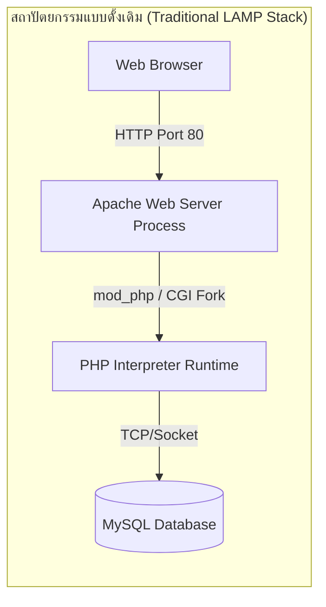
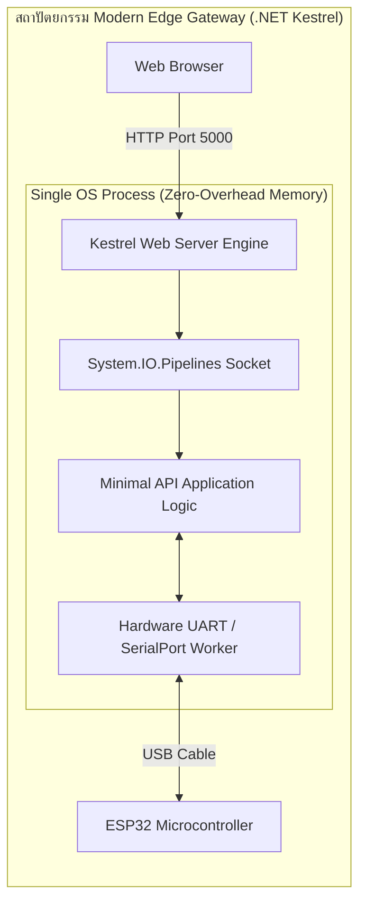
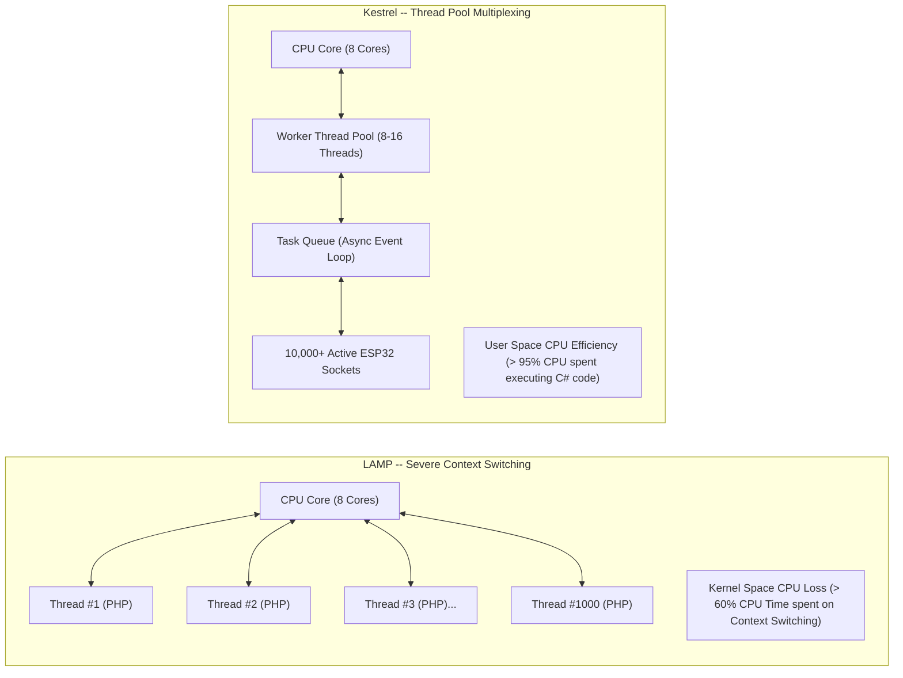
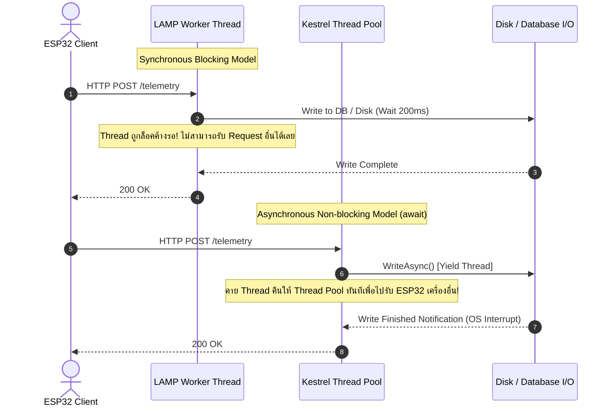
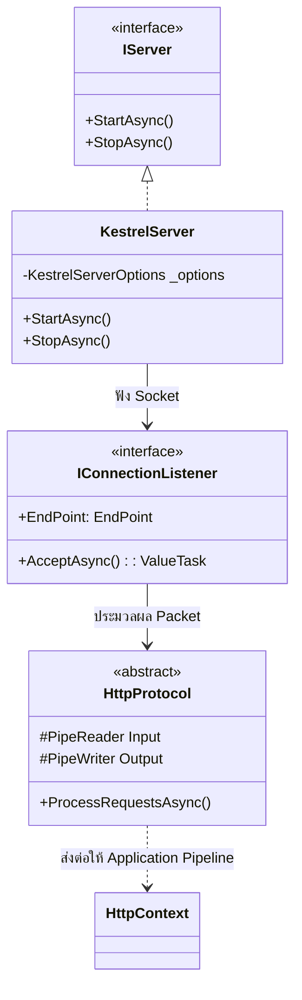
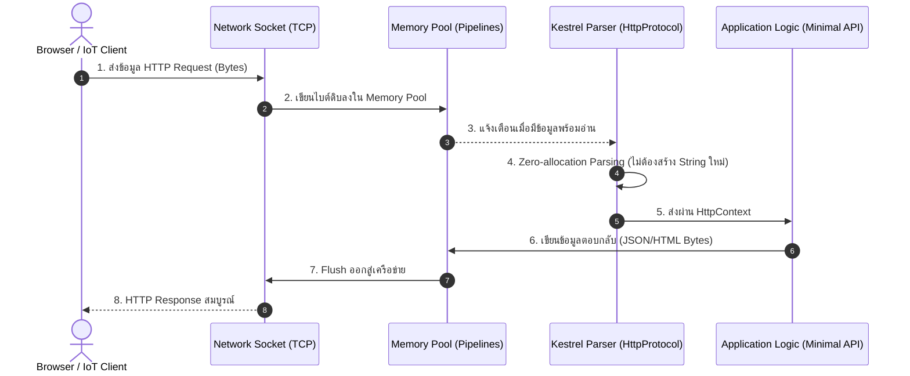

# 1. สถาปัตยกรรม Edge Web Server และ Kestrel Engine

> **วัตถุประสงค์การเรียนรู้**
> 1. เข้าใจวิวัฒนาการของ Web Server จากโมเดล LAMP สู่ Self-Hosted Edge Gateway
> 2. เข้าใจสถาปัตยกรรมภายในของ Kestrel Web Server ผ่านมุมมอง Logical และ Process View
> 3. ตระหนักถึงความสำคัญของการจัดการหน่วยความจำแบบ Non-blocking I/O ในงานอุปกรณ์ IoT
> 4. เข้าใจการวิเคราะห์ปัญหาเชิงประจักษ์ในสภาวะโหลดสูง (The C10K Problem, Context Switching, และ Non-blocking I/O)

---

## 1.1 วิวัฒนาการของ Web Server ในงาน IoT

### 1.1.1 ทำไมถึงไม่ใช้ LAMP Stack

ในยุคแรกเริ่มของเว็บแอปพลิเคชัน โมเดลที่ได้รับความนิยมสูงสุดคือ **LAMP Stack** (Linux, Apache, MySQL, PHP) ซึ่งถูกออกแบบมาสำหรับเซิร์ฟเวอร์ขนาดใหญ่ใน Data Center

#### ข้อจำกัดของ LAMP Stack บนอุปกรณ์ Edge IoT (เช่น Raspberry Pi / Industrial IPC)
1. **การแยกส่วนของโปรเซส (Process Fragmentation)** 
   ต้องติดตั้ง Apache/Nginx แยกกับตัวรันภาษา (PHP/Python) และต้องคอนฟิก Web Server ให้ชี้ไปยังโฟลเดอร์ไฟล์สคริปต์
2. **การกินทรัพยากรสูง (High Resource Footprint)** 
   โมเดล Fork Process หรือสร้าง Thread ใหม่ต่อทุกๆ HTTP Request กิน RAM สูง ไม่เหมาะกับอุปกรณ์ Embedded
3. **ขาดการเข้าถึง Hardware ระดับลึก** 
   สคริปต์เว็บส่วนใหญ่รันอยู่บน Sandboxed Environment ทำให้การเปิดพอร์ต Serial (UART), ดักฟังขา GPIO, หรือสื่อสารกับไมโครคอนโทรลเลอร์ทำได้ยากและล่าช้า

#### ทางออกของยุคใหม่ --> Self-Hosted Single-Binary Gateway
ในสถาปัตยกรรม IoT ยุคใหม่ เราต้องการเซิร์ฟเวอร์ที่เป็น **"Single Executable"** (ไฟล์ไบนารีเดียว) ที่มี Web Server คุณภาพสูงฝังอยู่ในตัวกระบวนการ (In-Process Web Server) ซึ่งสามารถรันได้ทันทีโดยไม่ต้องติดตั้ง Web Server ภายนอกใด ๆ เพิ่มเติม
 

---
# Web server implementations in ASP.NET Core
https://learn.microsoft.com/en-us/aspnet/core/fundamentals/servers/?view=aspnetcore-10.0&tabs=windows

---

### 1.1.2 การวิเคราะห์ปัญหาเชิงประจักษ์ในสภาวะโหลดสูง (Empirical Analysis & Proof of Bottlenecks)

เพื่อให้นักศึกษาเห็นภาพความแตกต่างอย่างชัดเจนในการใช้งานจริง (Production Environment) เราสามารถวิเคราะห์ปัญหาเชิงประจักษ์ของ LAMP Stack เมื่อต้องรับโหลด IoT Telemetry จากอุปกรณ์ ESP32 จำนวน 1,000 ถึง 10,000 บอร์ดพร้อมกัน ได้ดังนี้

#### ปัญหาประการที่ 1 การขาดแคลนหน่วยความจำและ Thread Exhaustion (The C10K Problem)

ในสถาปัตยกรรมแบบ LAMP (เช่น Apache MPM Prefork + PHP-FPM) การประมวลผล Request แต่ละตัวจำเป็นต้องใช้ Process หรือ Thread เฉพาะแยกขาดจากกัน

$$\text{RAM Total Required} = \text{Base System Memory} + \left( N_{\text{Concurrent Requests}} \times \text{RAM per PHP Process} \right)$$

* **กรณีศึกษา LAMP Stack**
  * สมมติมี ESP32 จำนวน **1,000 บอร์ด** ยิงข้อมูล HTTP POST เข้ามาทุกๆ 1 วินาที
  * หากการประมวลผล PHP + การเขียนลงฐานข้อมูล MySQL ใช้เวลา $200 \text{ ms}$ ($0.2 \text{ วินาที}$)
  * จำนวน Concurrent Active Requests ณ เสี้ยววินาทีใดๆ เท่ากับ:
    $$N_{\text{Concurrent}} = 1,000 \text{ req/sec} \times 0.2 \text{ sec} = 200 \text{ concurrent processes}$$
  * หากแต่ละ PHP Process ใช้หน่วยความจำเฉลี่ย $25 \text{ MB}$:
    $$\text{RAM Required} = 200 \times 25 \text{ MB} = 5,000 \text{ MB} \approx 5 \text{ GB RAM}!$$
  * หากเพิ่มจำนวน ESP32 เป็น **5,000 บอร์ด** ระบบจะต้องใช้ RAM สูงถึง **25 GB** เพื่อรองรับการจอง Process
  * **ผลลัพธ์เชิงประจักษ์** 
    เมื่อ RAM เต็ม เซิร์ฟเวอร์จะติดขีดจำกัด `MaxRequestWorkers` ทำให้ Request ที่เหลือโดนปฏิเสธเกิดข้อผิดพลาด **`HTTP 503 Service Unavailable`** หรือถูก **Linux OOM (Out of Memory) Killer** สั่งลบ Process ทิ้งทันที

* **กรณีศึกษา Kestrel (.NET 8/9)**
  * Kestrel ใช้สถาปัตยกรรม **Non-blocking Socket (epoll/IOCP)** โดยจองเฉพาะ Buffer สำหรับ Socket ในระดับ Kernel เพียง **~2 - 4 KB ต่อ Connection**
  * สำหรับ 1,000 Connection Kestrel ใช้ RAM สำหรับ Socket Buffer เพียง **~4 MB** ร่วมกับ Base RAM ของ .NET Runtime (~30 - 50 MB) 
    รวมแล้วใช้ RAM ไม่ถึง **100 MB** เท่านั้น

---

#### ปัญหาประการที่ 2 CPU Context Switching Overhead

เมื่อ OS ต้องบริหารจัดการ Thread จำนวนหลายร้อยถึงหลายพัน Threads พร้อมกันบน CPU Core ที่มีจำนวนจำกัด (เช่น 8 Cores)

* **ผลลัพธ์เชิงประจักษ์** 
  * **บน LAMP Stack** 
    ค่า **`%sys` (Kernel System CPU Time)** จะพุ่งสูงขึ้นอย่างมาก เนื่องจาก CPU ต้องเสียเวลาสลับ Register, Stack Pointer และล้าง CPU L1/L2 Cache คืนพื้นที่ให้ Thread ถัดไป แทนที่จะเอา CPU ไปประมวลผลโค้ดจริง
  * **บน Kestrel** 
    ค่า **`%sys`** จะต่ำมาก และค่า **`%user`** จะถูกนำไปใช้ประมวลผลข้อมูลเซนเซอร์ได้อย่างเต็มประสิทธิภาพ 100%

---

#### ปัญหาประการที่ 3 Blocking I/O Wait (การค้างรอแบบไร้ประโยชน์)

เปรียบเทียบวงจรชีวิตของ Thread ระหว่างการทำงานแบบ Sync (LAMP) และ Async (Kestrel) ขณะรอการบันทึกข้อมูลดิสก์/ฐานข้อมูล

---

## 1.2 รู้จัก Kestrel Web Server — หัวใจของ Modern .NET

**Kestrel** คือ Web Server ประสิทธิภาพสูงที่เป็นแกนหลักของ ASP.NET Core ถูกพัฒนาขึ้นใหม่ทั้งหมดโดยทีมวิศวกรของ Microsoft โดยเน้นความเร็วระดับแนวหน้าของโลก (Benchmark ติดอันดับท็อปบน TechEmpower) และรองรับการทำงานแบบ Cross-Platform (Windows, Linux, macOS, Linux ARM32/ARM64)

### 1.2.1 Logical View (มุมมองเชิงตรรกะ)
โครงสร้างภายในของ Kestrel ถูกออกแบบตามแนวคิด Interface-Driven

* **`IServer` / `KestrelServer`** — ตัวบริหารจัดการ Lifecycle ของเว็บเซิร์ฟเวอร์
* **`IConnectionListener`** — คอย Bind พอร์ต TCP และ Listen การเชื่อมต่อจาก Client
* **`HttpProtocol`** — ถอดรหัส Raw Bytes ให้กลายเป็นโครงสร้าง HTTP (Method, Path, Headers, Body)
* **`HttpContext`** — ออบเจกต์ศูนย์รวมข้อมูล Request และ Response ที่ส่งต่อไปยังโค้ดของนักศึกษา

---

## 1.3 สถาปัตยกรรม Non-blocking I/O และ `System.IO.Pipelines`

จุดเด่นสำคัญที่สุดที่ทำให้ Kestrel ทำงานได้เร็วและกินแรมน้อยมากบนอุปกรณ์ IoT คือการใช้ **`System.IO.Pipelines`**

- **Zero-Allocation Parsing**
   Kestrel จะไม่แปลงไบต์ของ Header ให้เป็น String ในหน่วยความจำหากไม่จำเป็น แต่จะใช้ Pointer/Span ชี้ไปยังบัฟเฟอร์เดิม ช่วยลดภาระของ Garbage Collector (GC) อย่างมหาศาล
- **Thread Pool Integration**
  การรอข้อมูลจากเครือข่ายจะไม่บล็อกเธรด (Non-blocking I/O) ทำให้เซิร์ฟเวอร์ขนาดเล็กบน Edge สามารถรองรับการเชื่อมต่อพร้อมกันได้หลายร้อยไคลเอนต์

---

## 1.4 สรุปสาระสำคัญ
- การนำ Kestrel มาทำเป็น **Edge IoT Gateway** ช่วยลดความซับซ้อนของระบบ ไม่ต้องพึ่งพา LAMP Stack อีกต่อไป
- ตัวแอปพลิเคชันเป็นโปรเซสเดียวที่จัดการทั้ง Web API และการสื่อสารกับฮาร์ดแวร์ได้อย่างไร้รอยต่อ
- ประสิทธิภาพของ Kestrel บนอุปกรณ์ฝังตัวเปิดโอกาสให้เราสามารถดึงข้อมูลเซนเซอร์ความเร็วสูงมาประมวลผลและเสิร์ฟขึ้นหน้าเว็บได้แบบทันที

