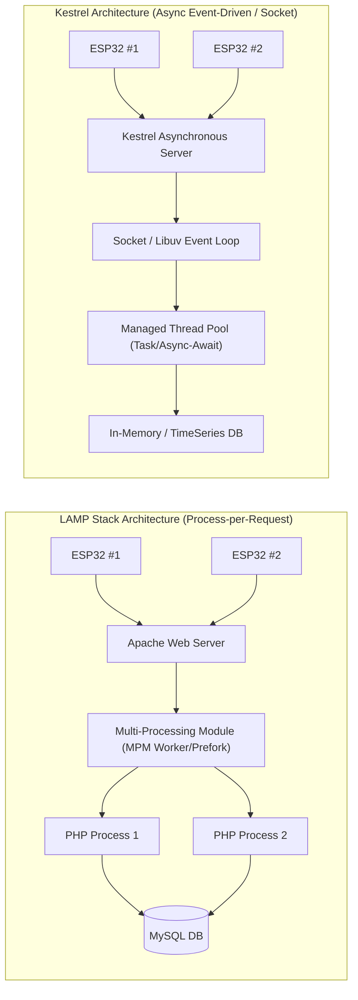
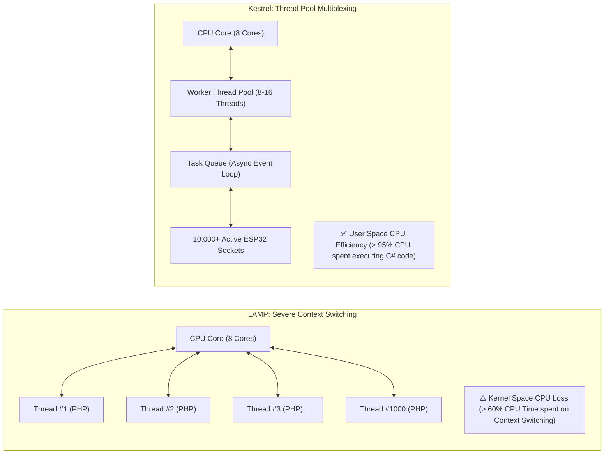
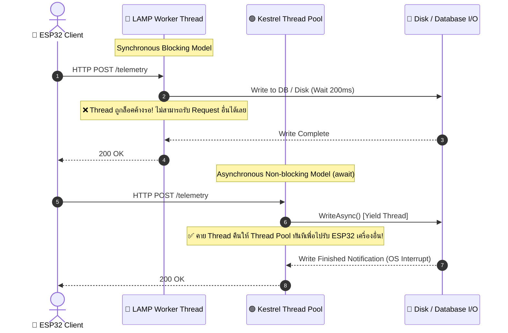
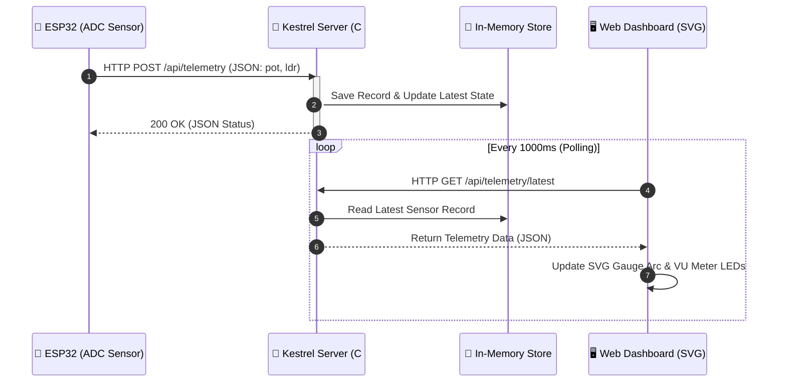

# บทเรียนที่ 8.1: เปรียบเทียบสถาปัตยกรรม Kestrel Web Server (.NET) กับ LAMP Stack สำหรับงาน IoT Telemetry

## 1. บทนำ (Introduction)

ในยุคเริ่มต้นของการพัฒนาเว็บแอปพลิเคชัน สถาปัตยกรรมแบบ **LAMP Stack** (Linux, Apache, MySQL, PHP) ถูกใช้อย่างแพร่หลายเนื่องจากง่ายต่อการติดตั้งและใช้งาน อย่างไรก็ตาม เมื่อระบบเปลี่ยนผ่านเข้าสู่ยุค **Internet of Things (IoT)** ที่มีอุปกรณ์ไมโครคอนโทรลเลอร์นับพันนับหมื่นเครื่องคอยยิงข้อมูลเซนเซอร์ (Telemetry Data) เข้ามาในระบบอย่างต่อเนื่อง (High Frequency & High Concurrency) สถาปัตยกรรมแบบดั้งเดิมเริ่มเจอปัญหาคอขวดด้านประสิทธิภาพและความซับซ้อนในการบริหารจัดการทรัพยากร

การมาถึงของ **.NET Core / .NET (8/9)** และ **Kestrel Web Server** ได้เข้ามาปฏิวัติวงการ Web Server ด้วยการใช้สถาปัตยกรรม **Asynchronous Non-blocking I/O** ที่ทำความเร็วได้สูงในระดับหลายล้าน Request ต่อวินาที (RPS) และใช้หน่วยความจำ RAM ต่ำมาก เหมาะอย่างยิ่งสำหรับการทำเป็นศูนย์กลางรับข้อมูลจากอุปกรณ์ IoT (IoT Telemetry Gateway)

---

## 2. การเปรียบเทียบสถาปัตยกรรม: LAMP Stack vs Kestrel (.NET)



### 2.1 โครงสร้างการทำงานของ Apache (LAMP)
- **Process/Thread-per-Request Model:** เมื่อมี HTTP Request ยิงเข้ามาจาก ESP32 ตัว Apache จะต้องทำการ Fork Process ใหม่ หรือดึง Worker Thread ใน Pool ขึ้นมาเพื่อประมวลผลสคริปต์ PHP ตั้งแต่เริ่มต้นจนจบกระบวนการ
- **Overhead สูง:** หากมี ESP32 จำนวน 1,000 เครื่องยิงข้อมูลมาพร้อมกัน เซิร์ฟเวอร์จะต้องใช้ RAM มหาศาลในการจอง Context Switch ของ PHP Process
- **Blocking I/O:** สคริปต์ PHP มักทำงานแบบ Sync (รออ่านไฟล์หรือรอเขียน DB สำเร็จก่อนจึงจะคืน Response) ทำให้เกิดการค้างรอ (I/O Wait)

### 2.2 โครงสร้างการทำงานของ Kestrel (.NET)
- **Asynchronous Event-Driven Engine:** Kestrel ทำงานอยู่บน Socket Layer / Libuv แบบ Non-blocking I/O คล้ายกับ Node.js แต่เขียนด้วยภาษา C# ที่ถูกคอมไพล์เป็น Native Machine Code (IL/JIT/AOT)
- **Thread Pool Efficiency:** เมื่อ ESP32 ยิงข้อมูลเข้ามา Thread จะรับเรื่องแล้วส่งต่อให้ Background Task ทำงานโดยไม่ต้องบล็อก Thread เดิม ทำให้ Thread เดียวสามารถรองรับ Connection ได้นับแสนรายการ
- **Minimal Footprint:** ใช้ memory RAM เริ่มต้นเพียงไม่กี่ megabytes และสามารถรันบนบอร์ด Raspberry Pi หรือ Container ขนาดเล็กได้สบาย

---

### 2.3 การวิเคราะห์ปัญหาเชิงประจักษ์ในสภาวะโหลดสูง (Empirical Analysis & Proof of Bottlenecks)

เพื่อให้นักศึกษาเห็นภาพความแตกต่างอย่างชัดเจนในการใช้งานจริง (Production Environment) เราสามารถวิเคราะห์ปัญหาเชิงประจักษ์ของ LAMP Stack เมื่อต้องรับโหลด IoT Telemetry จากอุปกรณ์ ESP32 จำนวน 1,000 ถึง 10,000 บอร์ดพร้อมกัน ได้ดังนี้:

#### ปัญหาประการที่ 1: การขาดแคลนหน่วยความจำและ Thread Exhaustion (The C10K Problem)

ในสถาปัตยกรรมแบบ LAMP (เช่น Apache MPM Prefork + PHP-FPM) การประมวลผล Request แต่ละตัวจำเป็นต้องใช้ Process หรือ Thread เฉพาะแยกขาดจากกัน:

$$\text{RAM Total Required} = \text{Base System Memory} + \left( N_{\text{Concurrent Requests}} \times \text{RAM per PHP Process} \right)$$

* **กรณีศึกษา LAMP Stack:**
  * สมมติมี ESP32 จำนวน **1,000 บอร์ด** ยิงข้อมูล HTTP POST เข้ามาทุกๆ 1 วินาที
  * หากการประมวลผล PHP + การเขียนลงฐานข้อมูล MySQL ใช้เวลา $200 \text{ ms}$ ($0.2 \text{ วินาที}$)
  * จำนวน Concurrent Active Requests ณ เสี้ยววินาทีใดๆ เท่ากับ:
    $$N_{\text{Concurrent}} = 1,000 \text{ req/sec} \times 0.2 \text{ sec} = 200 \text{ concurrent processes}$$
  * หากแต่ละ PHP Process ใช้หน่วยความจำเฉลี่ย $25 \text{ MB}$:
    $$\text{RAM Required} = 200 \times 25 \text{ MB} = 5,000 \text{ MB} \approx 5 \text{ GB RAM}!$$
  * หากเพิ่มจำนวน ESP32 เป็น **5,000 บอร์ด** ระบบจะต้องใช้ RAM สูงถึง **25 GB** เพื่อรองรับการจอง Process!
  * **ผลลัพธ์เชิงประจักษ์:** เมื่อ RAM เต็ม เซิร์ฟเวอร์จะติดขีดจำกัด `MaxRequestWorkers` ทำให้ Request ที่เหลือโดนปฏิเสธเกิดข้อผิดพลาด **`HTTP 503 Service Unavailable`** หรือถูก **Linux OOM (Out of Memory) Killer** สั่งลบ Process ทิ้งทันที

* **กรณีศึกษา Kestrel (.NET 8/9):**
  * Kestrel ใช้สถาปัตยกรรม **Non-blocking Socket (epoll/IOCP)** โดยจองเฉพาะ Buffer สำหรับ Socket ในระดับ Kernel เพียง **~2 - 4 KB ต่อ Connection**
  * สำหรับ 1,000 Connection Kestrel ใช้ RAM สำหรับ Socket Buffer เพียง **~4 MB** ร่วมกับ Base RAM ของ .NET Runtime (~30 - 50 MB) รวมแล้วใช้ RAM ไม่ถึง **100 MB** เท่านั้น!

---

#### ปัญหาประการที่ 2: CPU Context Switching Overhead

เมื่อ OS ต้องบริหารจัดการ Thread จำนวนหลายร้อยถึงหลายพัน Threads พร้อมกันบน CPU Core ที่มีจำนวนจำกัด (เช่น 8 Cores):



* **ผลลัพธ์เชิงประจักษ์:** 
  * บน LAMP Stack ค่า **`%sys` (Kernel System CPU Time)** จะพุ่งสูงขึ้นอย่างมาก เนื่องจาก CPU ต้องเสียเวลาสลับ Register, Stack Pointer และล้าง CPU L1/L2 Cache คืนพื้นที่ให้ Thread ถัดไป แทนที่จะเอา CPU ไปประมวลผลโค้ดจริง
  * บน Kestrel ค่า **`%sys`** จะต่ำมาก และค่า **`%user`** จะถูกนำไปใช้ประมวลผลข้อมูลเซนเซอร์ได้อย่างเต็มประสิทธิภาพ 100%

---

#### ปัญหาประการที่ 3: Blocking I/O Wait (การค้างรอแบบไร้ประโยชน์)

เปรียบเทียบวงจรชีวิตของ Thread ระหว่างการทำงานแบบ Sync (LAMP) และ Async (Kestrel) ขณะรอการบันทึกข้อมูลดิสก์/ฐานข้อมูล:



* **สรุปเชิงประจักษ์:** ในสถาปัตยกรรมแบบ Kestrel เมื่อโค้ดสั่ง `await` Thread จะถูกปล่อยคืนสู่ Thread Pool ทันที ทำให้ **1 Worker Thread สามารถรองรับ HTTP Request จาก ESP32 ได้พร้อมกันหลายพันเครื่อง** โดยไม่ต้องเสียเวลานั่งรอ I/O เลยแม้แต่วินาทีเดียว


---

## 3. ตารางเปรียบเทียบเชิงลึก (Comparison Matrix)

| คุณสมบัติ (Features) | LAMP Stack (Apache + PHP) | Kestrel (.NET 8/9 Minimal API) |
| :--- | :--- | :--- |
| **I/O Model** | Blocking / Synchronous (Default) | Non-blocking / Asynchronous (`async/await`) |
| **Concurrency Management** | Thread/Process per connection | Event-loop + Managed Thread Pool |
| **Requests Per Second (RPS)** | ปานกลาง (~10k - 50k RPS) | สูงมาก (> 1,000,000 RPS จากการทดสอบ TechEmpower Benchmark) |
| **Resource Consumption** | RAM High (500MB - 2GB+) | RAM Ultra Low (~30MB - 100MB) |
| **Language Support** | PHP | C# / F# / VB.NET |
| **Type Safety** | Dynamic / Weakly Typed | Static / Strongly Typed (ลด Runtime Bug ใน IoT Payload) |
| **Deployment** | จำเป็นต้องลง Apache/Nginx + PHP-FPM | Single Executable / Self-contained Binary |

---

## 4. ทำความรู้จัก Minimal API ใน ASP.NET Core

ในสถาปัตยกรรม C# ยุคก่อน การสร้าง Web API ต้องใช้ Controller, Routing Attributes และ Class ซับซ้อนหลายไฟล์ คล้ายกับ MVC Pattern

ใน **.NET 6/7/8/9** ได้เปิดตัว **Minimal API** ซึ่งช่วยให้เราสร้าง Web Server REST API ประสิทธิภาพสูงได้ด้วยโค้ดเพียงไม่กี่บรรทัดในไฟล์ `Program.cs` เพียงไฟล์เดียว เหมาะอย่างยิ่งสำหรับการทำ IoT Microservices:

```csharp
var builder = WebApplication.CreateBuilder(args);
var app = builder.Build();

// รับข้อมูล HTTP POST จาก ESP32
app.MapPost("/api/telemetry", (TelemetryData data) => {
    Console.WriteLine($"Received POT: {data.Potentiometer}");
    return Results.Ok(new { status = "success" });
});

app.Run("http://0.0.0.0:5000");
```

---

## 5. สถาปัตยกรรมระบบ IoT Telemetry ประจำสัปดาห์ที่ 8

ในบทเรียนนี้ เราจะสร้างท่อส่งข้อมูล (Data Pipeline) ดังผังด้านล่าง:


