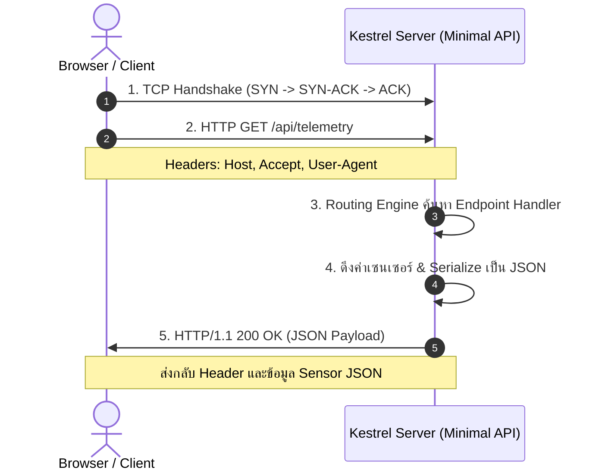

# บทเรียนที่ 2: โพรโทคอล HTTP และการพัฒนา Minimal APIs สำหรับงาน IoT

> **วัตถุประสงค์การเรียนรู้:**
> 1. เข้าใจขั้นตอนการตรวจสอบและเตรียมสภาพแวดล้อม .NET SDK และคำสั่ง CLI ที่สำคัญ
> 2. เข้าใจโครงสร้างและวงจรการทำงานของโพรโทคอล HTTP (Request-Response Lifecycle)
> 3. เข้าใจข้อแตกต่างระหว่าง Traditional MVC Controllers กับ Modern C# Minimal APIs
> 4. สามารถออกแบบ Endpoint และกำหนด Data Contract (JSON Serialization) สำหรับข้อมูลเซนเซอร์
> 5. รู้วิธีการส่งและรับข้อมูลผ่าน Path Parameters และ Query Parameters

---

## 1. สภาพแวดล้อมและเครื่องมือพัฒนา .NET CLI

ก่อนเริ่มพัฒนา Minimal API สำหรับ IoT Gateway ควรตรวจสอบสภาพแวดล้อมของเครื่องพัฒนา:

### 1.1 การตรวจสอบเวอร์ชัน .NET SDK
เปิด Terminal หรือ PowerShell แล้วรันคำสั่ง:
```powershell
dotnet --version
```
ตรวจสอบรายการ SDK ทั้งหมดที่ติดตั้งอยู่ในเครื่อง:
```powershell
dotnet --list-sdks
```

### 1.2 คำสั่ง CLI สำคัญสำหรับวงจรการพัฒนา
* **`dotnet new web -o <ProjectName>`**: สร้างโครงสร้างโปรเจกต์เว็บเปล่าแบบ Minimal
* **`dotnet build`**: คอมไพล์โปรเจกต์เพื่อตรวจสอบไวยากรณ์และข้อผิดพลาด
* **`dotnet run`**: คอมไพล์และเปิดรัน Kestrel Web Server
* **`dotnet watch`**: รันเว็บเซิร์ฟเวอร์ในโหมด **Hot Reload** (เมื่อแก้ไขและบันทึกโค้ด ระบบจะอัปเดตการทำงานอัตโนมัติทันทีโดยไม่ต้องกด Stop/Run ใหม่)

---

## 2. วงจรการทำงานของโพรโทคอล HTTP (HTTP Lifecycle)

โพรโทคอล **HTTP (Hypertext Transfer Protocol)** เป็นสถาปัตยกรรมแบบ **Request / Response** โดยที่ Client (เช่น Web Browser หรือแอปมือถือ) จะเป็นผู้เปิดการเชื่อมต่อ TCP และส่งคำขอไปยัง Server จากนั้น Server จะประมวลผลและส่งผลลัพธ์กลับมาพร้อมปิดหรือคงสถานะการเชื่อมต่อ:



### โครงสร้างของ HTTP Message:
1. **Request Line / Status Line:**
   - Request: `GET /api/sensor/34 HTTP/1.1` (Method, Path, Version)
   - Response: `HTTP/1.1 200 OK` (Version, Status Code, Status Message)
2. **Headers:** ข้อมูลเมทาดาทา (Metadata) เช่น `Content-Type: application/json`, `Content-Length: 48`
3. **Body (Payload):** ข้อมูลจริง เช่น สตริง JSON หรือไบนารีข้อมูล (มีเฉพาะในคำขอแบบ POST/PUT หรือในการตอบกลับ)

---

## 3. วิวัฒนาการสู่ Minimal APIs ใน Modern C#

ในอดีต การสร้าง Web API ใน .NET Framework หรือ ASP.NET Core รุ่นเก่า จำเป็นต้องสร้างคลาสและโฟลเดอร์จำนวนมาก:
- โฟลเดอร์ `Controllers/`
- คลาสที่สืบทอดจาก `ControllerBase`
- การใส่ Attributes เช่น `[ApiController]`, `[Route("api/[controller]")]`, `[HttpGet]`

### Minimal APIs: โค้ดที่กระชับ ตรงไปตรงมา
ตั้งแต่ .NET 6 เป็นต้นมา สถาปัตยกรรม **Minimal APIs** ได้ถูกนำมาใช้เพื่อตัดโค้ดส่วนเกิน (Boilerplate Code) ทั้งหมดออกไป ทำให้การเขียน Endpoint สั้น กระชับ และเข้าใจได้ง่ายเหมือนการเขียนฟังก์ชัน Lambda:

```csharp
// ตัวอย่าง Minimal API ที่สมบูรณ์ใน 4 บรรทัด
var builder = WebApplication.CreateBuilder(args);
var app = builder.Build();

app.MapGet("/api/ping", () => "pong");

app.Run();
```

---

## 4. การเปิดรับการเชื่อมต่อข้ามเครื่อง (LAN Binding & CORS)

เมื่อพัฒนา IoT Gateway ที่ต้องให้เครื่องอื่นในเครือข่ายเข้าถึงได้:

```csharp
var builder = WebApplication.CreateBuilder(args);

// 1. กำหนดให้ Kestrel เปิดรับทุก IP Address บนพอร์ต 5000 (0.0.0.0:5000)
builder.WebHost.ConfigureKestrel(options =>
{
    options.ListenAnyIP(5000);
});

// 2. ตั้งค่า CORS (Cross-Origin Resource Sharing) เพื่อให้เว็บเบราว์เซอร์จากโดเมนอื่นดึง API ได้
builder.Services.AddCors(options =>
{
    options.AddPolicy("AllowAll", policy =>
    {
        policy.AllowAnyOrigin().AllowAnyMethod().AllowAnyHeader();
    });
});

var app = builder.Build();
app.UseCors("AllowAll");

// เปิดใช้งาน Static Web (HTML, CSS, JS ใน wwwroot)
app.UseDefaultFiles();
app.UseStaticFiles();
```

---

## 5. กลไก JSON Serialization อัตโนมัติ (Zero-Config JSON)

หนึ่งในจุดเด่นที่ทำให้การพัฒนา IoT Gateway บน .NET สะดวกมาก คือ **`System.Text.Json`** ที่ถูกติดตั้งและคอนฟิกมาในตัว:

### ตัวอย่างการส่งค่า Anonymous Object (ออบเจกต์นิรนาม)
```csharp
app.MapGet("/api/status", () => new {
    device = "ESP32-Gateway",
    firmware = "v1.0.0",
    uptimeSeconds = Environment.TickCount64 / 1000,
    isHealthy = true
});
```
เมื่อ Client ส่งคำขอ `GET /api/status`:
1. Kestrel จะตรวจพบว่า Handler คืนค่าออบเจกต์ C#
2. ระบบจะเรียกใช้ JSON Serializer แปลงข้อมูลเป็นไบต์ JSON โดยอัตโนมัติ
3. ระบบจะแนบ Header `Content-Type: application/json; charset=utf-8` ให้ทันที โดยผู้พัฒนาไม่ต้องเขียนคำสั่งแปลงแม้แต่บรรทัดเดียว!

```json
{
  "device": "ESP32-Gateway",
  "firmware": "v1.0.0",
  "uptimeSeconds": 142,
  "isHealthy": true
}
```

---

## 6. การออกแบบ Data Contract สำหรับข้อมูล Telemetry

ในงาน IoT ระดับมืออาชีพ แทนที่จะใช้ออบเจกต์นิรนาม (Anonymous Object) ตลอดเวลา เรามักจะนิยามโครงสร้างข้อมูลที่ชัดเจนด้วย **`record`** หรือ **`class`** ซึ่งในภาษา C# การใช้ `record` จะสร้าง Immutable Data Type ที่มีประสิทธิภาพสูง:

```csharp
// การประกาศ Data Contract สำหรับสัญญาณเซนเซอร์
public record SensorReading(
    string SensorId,
    int RawValue,
    double Voltage,
    double Percentage,
    DateTime Timestamp
);
```

### การคำนวณและส่งมอบข้อมูล:
```csharp
app.MapGet("/api/telemetry", () => {
    int rawAdc = 2048; // สมมติค่าจาก ADC 12-bit (0-4095)
    double voltage = Math.Round((rawAdc / 4095.0) * 3.3, 2);
    double percent = Math.Round((rawAdc / 4095.0) * 100.0, 1);

    return new SensorReading("ESP32-ADC34", rawAdc, voltage, percent, DateTime.UtcNow);
});
```

---

## 7. การรับคำสั่งควบคุม (Control Endpoints: Route & Query Parameters)

นอกจากส่งข้อมูลออกจากเซิร์ฟเวอร์แล้ว Web Gateway ยังต้องสามารถรับคำสั่งควบคุม (Actuation) เช่น เปิด-ปิดรีเลย์ หรือตั้งค่าหลอดไฟได้:

### 1. Route Parameter (รับค่าจาก URL Path)
```csharp
// ตัวอย่าง: GET /api/relay/1/on หรือ GET /api/relay/1/off
app.MapGet("/api/relay/{channel}/{state}", (int channel, string state) => {
    return Results.Ok(new {
        relay = channel,
        action = state,
        message = $"Relay {channel} set to {state.ToUpper()}"
    });
});
```

### 2. Query Parameter (รับค่าพารามิเตอร์ต่อท้ายเครื่องหมาย ?)
```csharp
// ตัวอย่าง: GET /api/fan?speed=75
app.MapGet("/api/fan", (int speed) => {
    // ป้องกันค่าเกินช่วง 0-100
    int safeSpeed = Math.Clamp(speed, 0, 100);
    return Results.Ok(new { fanSpeed = safeSpeed, status = "Running" });
});
```

---

## 8. สรุปสาระสำคัญ
- Minimal APIs ช่วยให้เราสร้าง RESTful Endpoints สำหรับอุปกรณ์ IoT ได้อย่างรวดเร็ว โค้ดสั้น กระชับ และมีประสิทธิภาพสูง
- การแปลงข้อมูล C# Data Model สู่ JSON เป็นไปโดยอัตโนมัติ ช่วยลดความผิดพลาดในการจัดรูปแบบสตริง
- การแบ่งแยก Endpoint อย่างเป็นระเบียบ (`/api/status`, `/api/telemetry`) ทำให้เว็บเบราว์เซอร์หรือแอปพลิเคชันภายนอกสามารถเข้ามาเชื่อมต่อได้อย่างมีมาตรฐาน
