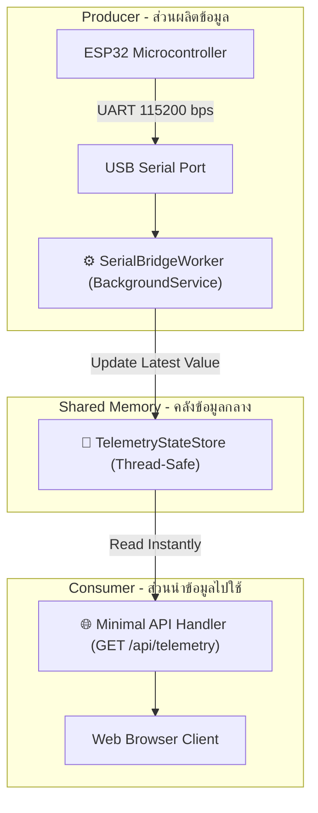
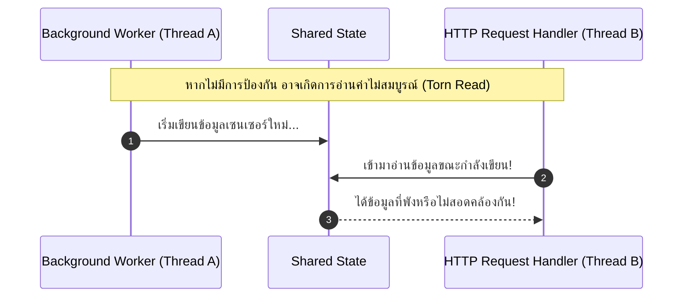
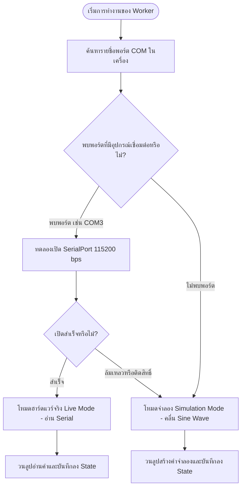

# 3 การเชื่อมต่อฮาร์ดแวร์กับเว็บเซิร์ฟเวอร์และการจัดการภาวะพร้อมกัน (Hardware Bridge & Concurrency)

> **วัตถุประสงค์การเรียนรู้**
> 1. เข้าใจปัญหาความไม่สอดคล้องของเวลา (Timing Disparity) ระหว่างงาน Web Request กับ Hardware Serial I/O
> 2. เข้าใจสถาปัตยกรรม `BackgroundService` (Worker Thread) ในการดักฟังข้อมูลอย่างต่อเนื่อง
> 3. สามารถใช้งานไลบรารี `System.IO.Ports` ในการสื่อสารกับ ESP32 ผ่านสาย USB
> 4. เข้าใจหลักการจัดการหน่วยความจำร่วมอย่างปลอดภัย (Thread-Safe Shared State)
> 5. สามารถออกแบบระบบ Dual-Mode: สลับระหว่างฮาร์ดแวร์จริงกับโหมดจำลอง (Fallback Simulation) อัตโนมัติ

---

## 3.1 ปัญหาความไม่สอดคล้องของเวลา Web Request vs Serial Stream

ในการออกแบบ IoT Gateway ข้อผิดพลาดที่พบบ่อยที่สุดของมือใหม่ คือ **การพยายามเปิดพอร์ต Serial ทุกครั้งที่มี HTTP Request เข้ามา**

```
❌ วิธีที่ผิด: Client ยิง GET /api/sensor -> Server เปิด COM3 -> รออ่านไบต์ -> ปิด COM3 -> ส่งกลับ
```
**ทำไมวิธีนี้ถึงใช้ไม่ได้จริง?**
1. **เวลาในการเปิดพอร์ต (Port Latency)** 
   การเปิด USB Virtual COM Port ใช้เวลา 10-50 มิลลิวินาที ทำให้การตอบสนองเว็บช้าลงอย่างมาก
2. **การแย่งทรัพยากร (Resource Locking)** 
   หากเบราว์เซอร์ 2 หน้าต่างกด Refresh พร้อมกัน คำขอที่สองจะเกิด Exception `UnauthorizedAccessException` ทันที เพราะพอร์ต COM กำลังถูกคำขอแรกใช้งานอยู่
3. **การสูญหายของข้อมูล (Buffer Overflow)** 
   ถ้า ESP32 ส่งข้อมูลมาเรื่อยๆ แต่เซิร์ฟเวอร์ไม่เปิดพอร์ตค้างไว้ ข้อมูลจะค้างใน Driver บัฟเฟอร์หรือล้นหายไป

---

## 3.2 สถาปัตยกรรม Producer-Consumer และ `BackgroundService`

ทางออกที่ถูกต้องตามมาตรฐานสากลคือการใช้รูปแบบ **Producer-Consumer Pattern**



### หน้าที่ของ `BackgroundService`
- `BackgroundService` เป็นคลาสพื้นฐานใน .NET ที่ทำงานบน Background Thread แยกขาดจาก ThreadPool ที่คอยรับ HTTP Request
- เธรดนี้จะเปิดพอร์ต Serial เพียงครั้งเดียวตอนเริ่มโปรเซส แล้ววนลูปดักฟัง `serialPort.ReadLine()` อยู่เบื้องหลังตลอดเวลา
- เมื่อได้ข้อมูลใหม่ จะนำไปบันทึกลงใน **State Store** กลาง

---

## 3.3 การจัดการหน่วยความจำร่วมแบบ Thread-Safe (Concurrency Control)

เนื่องจาก **SerialBridgeWorker** (คนเขียน) และ **Minimal API Handler** (คนอ่าน) ทำงานบนเธรดที่ต่างกัน และอาจเข้าถึงตัวแปรพร้อมกันในระดับไมโครวินาที



### วิธีการทำ Thread-Safe อย่างง่ายใน C#
เราสามารถสร้างคลาส `TelemetryStateStore` และใช้กลไก `lock` เพื่อป้องกันการชนกันของข้อมูล

```csharp
public class TelemetryStateStore
{
    private readonly object _lock = new();
    private int _rawValue = 0;
    private DateTime _lastUpdated = DateTime.UtcNow;

    // ฟังก์ชันสำหรับ Worker นำค่ามาอัปเดต (Writer)
    public void Update(int rawValue)
    {
        lock (_lock)
        {
            _rawValue = rawValue;
            _lastUpdated = DateTime.UtcNow;
        }
    }

    // ฟังก์ชันสำหรับ API เข้ามาอ่านค่าไปใช้งาน (Reader)
    public (int raw, DateTime timestamp) GetLatest()
    {
        lock (_lock)
        {
            return (_rawValue, _lastUpdated);
        }
    }
}
```

---

## 3.4 สถาปัตยกรรม Dual-Mode -- Auto-Detect & Fallback Simulation

ในสถานการณ์จริงในห้องเรียน หรือระหว่างที่ทีมพัฒนาฝั่งเว็บต้องการทดสอบหน้าบ้าน แต่ยังไม่มีบอร์ดฮาร์ดแวร์จริง หรือสาย USB หลวม ระบบที่ดีต้องไม่พัง (Fail-Safe)

เราจะออกแบบ **SerialBridgeWorker** ให้มี 2 โหมดการทำงานอัตโนมัติ



### โค้ดตัวอย่างการจำลองสัญญาณ (Simulation Fallback)
```csharp
// หากไม่มีฮาร์ดแวร์ ให้จำลองค่าแกว่งขึ้น-ลงเหมือนมีคนหมุน Volume จริง
double time = Environment.TickCount64 / 1000.0;
// สร้างคลื่นรูปไซน์แปลงเป็นช่วง 0 - 4095
int simulatedAdc = (int)((Math.Sin(time * 2.0) + 1.0) / 2.0 * 4095);
_stateStore.Update(simulatedAdc);
await Task.Delay(100, stoppingToken);
```

---

## 3.5 สรุปสาระสำคัญ
- ห้ามเปิด-ปิด Serial Port ในตัวฟังก์ชัน Web Request โดยเด็ดขาด
- ใช้ `BackgroundService` เป็น Worker คอยดักฟังพอร์ต USB Serial ตลอดเวลาอย่างอิสระ
- ปกป้องการอ่าน-เขียนตัวแปรส่วนกลางด้วย `lock` เพื่อป้องกันปัญหา Race Condition
- ออกแบบให้มี Fallback Simulation Mode เสมอ เพื่อให้นักศึกษาสามารถพัฒนาและทดสอบระบบเว็บได้แม้ในวันที่ไม่มีบอร์ดฮาร์ดแวร์
