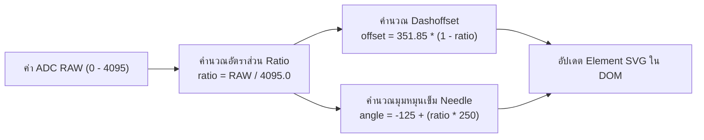
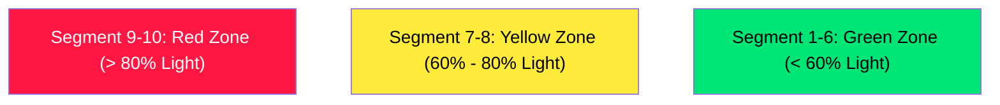

# บทเรียนที่ 8.3: ทฤษฎีและการออกแบบ Web Dashboard ด้วย SVG Radial Gauge และ Audio VU Meter

## 1. ทำความรู้จัก Scalable Vector Graphics (SVG) ในงาน Web Dashboard

ในหน้า Web Dashboard ของระบบ IoT การแสดงผลข้อมูลในรูปแบบภาพกราฟิกแบบบิตแมป (เช่น PNG, JPEG) มักประสบปัญหาภาพแตกเมื่อขยายหน้าจอ และไม่สามารถควบคุมการเปลี่ยนแปลงตำแหน่งหรือรูปร่างด้วยโปรแกรม JavaScript ได้โดยตรง

**SVG (Scalable Vector Graphics)** คือรูปแบบกราฟิกเวกเตอร์สองมิติที่เขียนขึ้นด้วยโครงสร้าง XML/HTML คุณสมบัติเด่นของ SVG คือ:
1. **Resolution Independent:** ภาพคมชัดทุกขนาดหน้าจอ ไม่ว่าจะเปิดบนสมาร์ตโฟน หรือจอภาพ 4K
2. **DOM Manipulable:** สามารถใช้ CSS และ JavaScript ปรับแต่งคุณสมบัติ เช่น สี (`fill`, `stroke`), ความหนาเส้น (`stroke-width`), ตำแหน่ง และมุมหมุน ได้อย่างอิสระ
3. **High Performance:** ประมวลผลภาพบน GPU ผ่านเบราว์เซอร์ ทำให้อัตราเฟรมเรตไหลลื่น 60 FPS

---

## 2. การสร้าง Radial Gauge ด้วย SVG Arc และการคำนวณ `stroke-dashoffset`

เกจวัดแบบโค้งวงกลม (Radial Gauge) สร้างขึ้นโดยใช้แท็ก `<path>` วาดเส้นโค้งส่วนหนึ่งของวงกลม (Arc)

```xml
<svg viewBox="0 0 200 200">
    <!-- เส้นโค้งพื้นหลัง (Background Track) -->
    <path class="gauge-bg" d="M 30 150 A 80 80 0 1 1 170 150" fill="none" stroke="#2d3748" stroke-width="16" />
    
    <!-- เส้นโค้งแสดงระดับค่า (Value Fill) -->
    <path class="gauge-fill" id="gauge-fill" d="M 30 150 A 80 80 0 1 1 170 150" fill="none" stroke="#00f2fe" stroke-width="16" stroke-dasharray="351.85" stroke-dashoffset="351.85" />
</svg>
```



### 2.1 สูตรการคำนวณระยะเส้นรอบวง (Arc Length)
เส้นโค้ง `d="M 30 150 A 80 80 0 1 1 170 150"` มีรัศมี $R = 80$ และมีมุมเปิดโค้งประมาณ $252^\circ$ (คิดเป็น $\approx 0.70$ ของวงกลมเต็ม)

ความยาวเส้นรอบวงทั้งหมด ($C$) คำนวณจาก:
$$C = 2 \times \pi \times R \times \left(\frac{252^\circ}{360^\circ}\right) \approx 2 \times 3.14159 \times 80 \times 0.7 \approx 351.85 \text{ pixels}$$

### 2.2 เทคนิคการซ่อน/แสดงเส้นด้วย `stroke-dasharray` และ `stroke-dashoffset`
- `stroke-dasharray="351.85"`: กำหนดให้ความยาวของรอยขีดและความว่างเว้นเท่ากับความยาวเส้นรอบวงทั้งหมด
- `stroke-dashoffset`: คือระยะที่เลื่อนเส้นออกไป หากกำหนดเท่ากับ `351.85` เส้นจะถูกซ่อนทั้งหมด (0%) และหากเลื่อนลดลงเหลือ `0` เส้นจะปรากฏเต็มวง (100%)

### 2.3 การคำนวณมุมหมุนเข็ม (Gauge Needle Angle)
เข็มของ Gauge วางเริ่มต้นที่แนวตั้ง ($0^\circ$) โดยเราให้ช่วงการหมุนครอบคลุมตั้งแต่ $-125^\circ$ ถึง $+125^\circ$ (รวมเป็นกวาดมุม $250^\circ$):

$$\theta = -125^\circ + \left( \frac{\text{ADC\_RAW}}{4095.0} \times 250^\circ \right)$$

ตัวอย่างใน JavaScript:
```javascript
const ratio = Math.max(0, Math.min(1, rawVal / 4095.0));
const offset = 351.85 * (1 - ratio);
const angle = -125 + (ratio * 250);

gaugeFill.style.strokeDashoffset = offset;
gaugeNeedle.style.transform = `rotate(${angle}deg)`;
```

---

## 3. การออกแบบ Audio-Style VU Meter สำหรับ LDR Sensor

**VU Meter (Volume Unit Meter)** เป็นมาตรวัดระดับสัญญาณที่นิยมใช้ในระบบเครื่องเสียง โดยแสดงผลเป็นแท่งหลอดไฟ LED เรียงแถวตามระดับความเข้มของสัญญาณ

ในบทเรียนนี้ เรานำ VU Meter มาประยุกต์ใช้แสดงความเข้มแสงสว่างจากเซนเซอร์ LDR (0% - 100%) โดยแบ่งออกเป็น 10 แท่ง (Bars) และแต่ละแท่งมี 10 หลอด (Segments)



### การกำหนด Color Zones ใน CSS
1. **โซนปกติ (Green Zone: 0% - 60%):** สีเขียวสด แสดงระดับแสงปกติถึงแสงสว่างปานกลาง
2. **โซนเฝ้าระวัง (Yellow Zone: 60% - 85%):** สีเหลืองจ้า แสดงระดับแสงสว่างสูง
3. **โซนแจ้งเตือน (Red Zone: 85% - 100%):** สีแดงเพลิง แสดงระดับแสงสว่างจ้าจัด (Overexposure)
