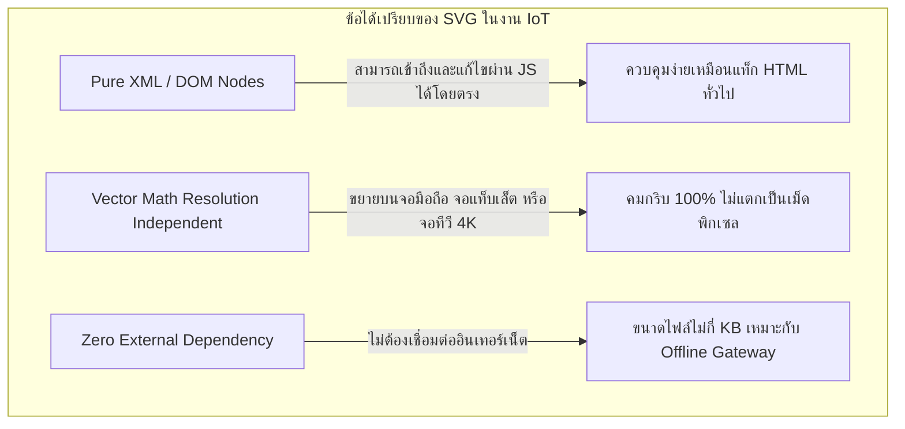
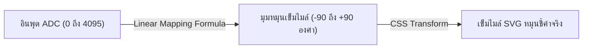
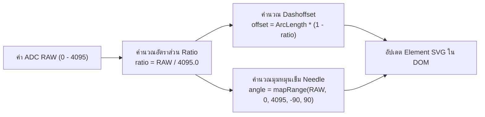
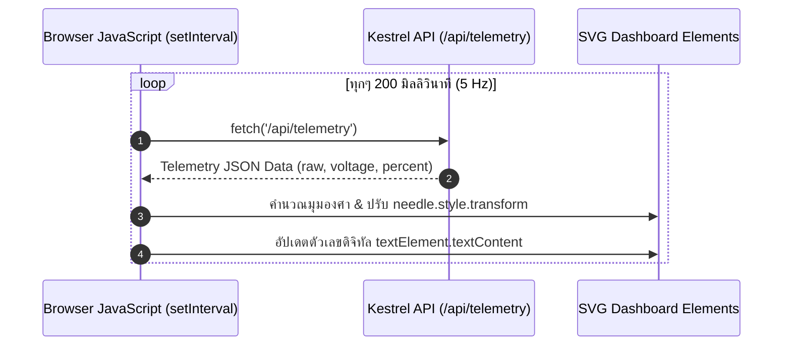

# 4. การแสดงผลเชิงภาพด้วย SVG และแดชบอร์ด IoT แบบตอบสนองทันที

> **วัตถุประสงค์การเรียนรู้**
> 1. เข้าใจข้อได้เปรียบของ Scalable Vector Graphics (SVG) ในงานแดชบอร์ดเครื่องมือวัด IoT
> 2. สามารถคำนวณการแปลงสเกลเชิงเส้น (Linear Mapping) จากค่า ADC สู่มุมองศาหรือพิกัดเรขาคณิต
> 3. รู้วิธีการคำนวณเส้นรอบวง Arc และการทำ Circular Progress ด้วย `stroke-dasharray` / `stroke-dashoffset`
> 4. รู้วิธีการควบคุม SVG DOM Elements ด้วย JavaScript และการสร้างแอนิเมชันที่ลื่นไหลด้วย CSS
> 5. เข้าใจโครงสร้างของวิดเจ็ตมาตรฐานอุตสาหกรรม: Speedometer, VU Meter และ 7-Segment Display

---

## 4.1 ความสำคัญของ SVG สำหรับ Industrial IoT Dashboard

ในงานพัฒนาหน้าจอแสดงผลของระบบควบคุมและ IoT วิศวกรมักเผชิญทางเลือกระหว่างกรณีต่างๆ ต่อไปนี้
1. **การใช้ Canvas API (`<canvas>`)** 
   เป็น Raster Bitmap วาดยาก ขยายหน้าจอแล้วภาพเบลอ ตกแต่งด้วย CSS ไม่ได้
2. **การโหลดไลบรารีภายนอก (Chart.js / D3.js / ECharts)**
   ขนาดไฟล์ใหญ่ (หลักร้อย KB ถึง MB), ต้องพึ่งพาอินเทอร์เน็ตในการดึง CDN, และกินทรัพยากรเบราว์เซอร์สูง
3. **Scalable Vector Graphics (SVG)**
   ทางเลือกที่ดีที่สุดสำหรับ Edge Dashboard




---

## 4.2 คณิตศาสตร์มาตรวัด -- การแปลงสเกลเชิงเส้น (Linear Mapping)

**จากสัปดาห์ที่ 2 - 3** 
สัญญาณจากไมโครคอนโทรลเลอร์ ESP32 มีค่าเป็นค่า **ADC 12-bit ($0 - 4095$)** แต่หน้าปัดมาตรวัด (เช่น Speedometer) ต้องการค่าเป็น **มุมองศา ($\theta$)**



### สูตรการแปลงเชิงเส้น (Linear Mapping Formula)
กำหนดให้:
- $X$ คือค่าที่อ่านได้จากเซนเซอร์ ($0 \le X \le 4095$)
- $[In_{min}, In_{max}] = [0, 4095]$
- $[Out_{min}, Out_{max}] = [-90^\circ, +90^\circ]$

$$Angle = Out_{min} + \left( \frac{X - In_{min}}{In_{max} - In_{min}} \right) \times (Out_{max} - Out_{min})$$

### ตัวอย่างการคำนวณใน JavaScript
```javascript
function mapRange(value, inMin, inMax, outMin, outMax) {
    return ((value - inMin) * (outMax - outMin)) / (inMax - inMin) + outMin;
}

// แปลงค่า ADC 2048 -> ได้มุมประมาณ 0 องศา (เข็มชี้ตรงกลางแนวตั้ง)
const angle = mapRange(adcValue, 0, 4095, -90, 90);
needleElement.style.transform = `rotate(${angle}deg)`;
```

---

## 4.3 เทคนิคเส้นโค้งความยาว Arc ด้วย `stroke-dasharray` และ `stroke-dashoffset`

นอกจากการหมุนเข็มไมล์แล้ว เรายังสามารถสร้างหลอดแถบโค้งรอบหน้าปัด (Radial Progress) ด้วยการปรับแต่งเส้นขอบของ SVG



### สูตรการคำนวณระยะเส้นรอบวงส่วนโค้ง (Arc Length)
สำหรับเส้นรอบวงรัศมี $R$ ที่กวาดมุม $\phi$ องศา
$$C_{\text{arc}} = 2 \times \pi \times R \times \left(\frac{\phi}{360^\circ}\right)$$

* ตัวอย่าง: หาก $R = 80$ พิกเซล และมุมกวาด $\phi = 252^\circ$
  $$C_{\text{arc}} \approx 2 \times 3.14159 \times 80 \times 0.7 \approx 351.85 \text{ พิกเซล}$$
* **`stroke-dasharray="351.85"`** กำหนดความยาวแพทเทิร์นเส้นประให้เท่ากับความยาวเส้นโค้งเต็ม
* **`stroke-dashoffset`** คือระยะเลื่อนเส้น
  - เมื่อค่าเท่ากับ `351.85`: ซ่อนเส้นทั้งหมด (0%)
  - เมื่อค่าลดลงเหลือ `0`: ปรากฏเส้นเต็มแถบ (100%)

---

## 4.4 เทคนิค CSS Transition เพื่อความนุ่มนวล (Buttery Smooth Movement)

หากเราอัปเดตมุมของเข็มไมล์ด้วย JavaScript ค่าจะกระตุกตามจังหวะที่รับข้อมูล แต่การเพิ่มคุณสมบัติ CSS เข้าไปเพียง 1 บรรทัดจะทำให้เบราว์เซอร์คำนวณการเคลื่อนที่ระหว่างจุดแบบอัตโนมัติ

```css
#needle {
    transform-origin: 150px 150px; /* จุดหมุนอยู่ที่จุดศูนย์กลางหน้าปัด */
    transition: transform 0.15s cubic-bezier(0.4, 0, 0.2, 1);
}

.gauge-fill {
    transition: stroke-dashoffset 0.15s ease-out;
}
```

---

## 4.5 สถาปัตยกรรม Client-Side Polling

หน้าเว็บจะทำหน้าที่เป็น **Consumer** คอยดึงข้อมูลจาก Minimal API ของ Kestrel เป็นระยะๆ อย่างสม่ำเสมอ



---

## 4.6 แค็ตตาล็อก SVG วิดเจ็ตมาตรฐาน (Widget Showcase)

### 4.6.1 Speedometer Gauge (มาตรวัดความเร็วทรงกลม)
- **ส่วนประกอบ**
  - `<circle>` หรือ `<path>` ทำเป็นรางสเกลโค้ง (Arc)
  - `<line>` หรือ `<polygon>` ทำเป็นเข็มไมล์ชี้ค่า
  - `<circle>` ตรงกลางทำเป็นหมุดครอบแกนหมุน

### 4.6.2 VU Meter (LED Bar Graph สไตล์เสียง/อุตสาหกรรม)
- **ส่วนประกอบ**
  - แถวของสี่เหลี่ยม `<rect>` เรียงกันในแนวตั้งหรือแนวนอน 10-20 ช่อง
  - แบ่งโซนสี: เขียว (ระดับปกติ 0-70%), เหลือง (ระดับเตือน 70-85%), แดง (ระดับอันตราย >85%)
  - JavaScript ควบคุมโดยการคำนวณจำนวนแท่งที่จะให้เปิดไฟเรืองแสง (`fill-opacity: 1` vs `fill-opacity: 0.15`)

### 4.6.3 Retro 7-Segment Display (หน้าจอตัวเลข 7 ส่วน)
- **ส่วนประกอบ**
  - แท่งรูปสี่เหลี่ยมคางหมู 7 ชิ้น (a, b, c, d, e, f, g)
  - แมปตัวเลข 0-9 เข้ากับตารางเปิด/ปิดของแต่ละ Segment:
    - เลข `8`: เปิดครบทั้ง 7 ชิ้น
    - เลข `1`: เปิดเฉพาะชิ้น `b` และ `c`
  - ตกแต่งด้วยแสงนีออนเรืองแสง (`filter: drop-shadow(...)`) สไตล์คลาสสิก

---

## 4.7 สรุปสาระสำคัญ
- SVG ให้คุณภาพการแสดงผลที่คมชัดระดับพรีเมียม กินทรัพยากรน้อย และทำงานแบบ Zero External Dependency
- การรวมพลังระหว่าง **SVG + CSS Transitions + Vanilla JS Fetch** ช่วยสร้างแดชบอร์ด IoT ที่ตอบสนองรวดเร็วและสวยงามได้ในไฟล์ HTML เดียว
- นักศึกษาสามารถนำพื้นฐานนี้ไปต่อยอดสร้างวิดเจ็ตแสดงผลเซนเซอร์ได้หลากหลายรูปแบบอย่างไร้ขีดจำกัด
