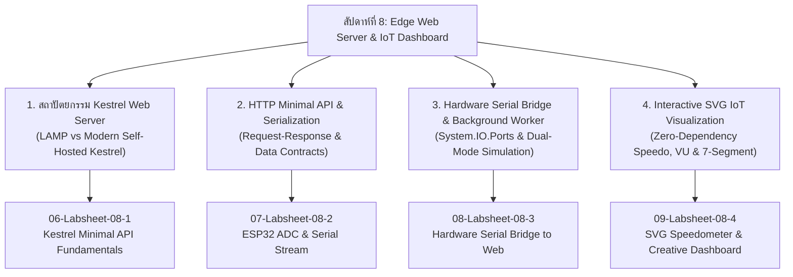
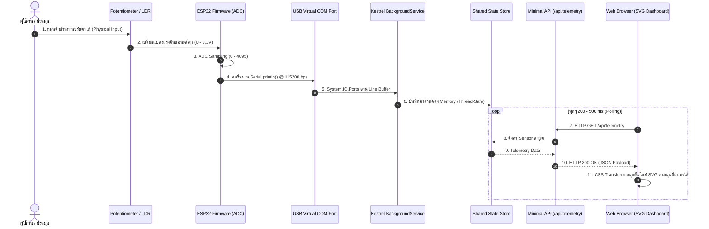

# Week 08: Edge Web Server Architecture, Minimal API & Interactive SVG IoT Dashboard

## 1. บทนำ (Introduction)
ในสัปดาห์ที่ 8 นี้ เราจะก้าวข้ามจากการเขียนโปรแกรมควบคุมไมโครคอนโทรลเลอร์แบบ Standalone เข้าสู่โลกของ **"Edge IoT Gateway & Web Server"** ซึ่งเป็นสะพานเชื่อมระหว่างโลกกายภาพ (Physical Hardware) กับโลกดิจิทัล (Web & Cloud Applications)

นักศึกษาส่วนใหญ่อาจคุ้นเคยกับโมเดล **LAMP Stack (Linux, Apache, MySQL, PHP)** ซึ่งมีสถาปัตยกรรมที่แยกส่วน ติดตั้งและคอนฟิกซับซ้อน ทว่าในโลกของ Industrial IoT และ Embedded Gateway สมัยใหม่ ความต้องการคือ **High-Performance, Self-Hosted, Single-Binary Application** ที่สามารถทำงานได้รวดเร็ว กินทรัพยากรต่ำ และควบคุม I/O ของเครื่องได้โดยตรง

ในบทเรียนนี้ เราจะใช้ **.NET 8 / Modern C# และ Kestrel Web Server** ในการสร้าง Web Gateway ที่ทรงประสิทธิภาพ สามารถรับส่งข้อมูลผ่าน **HTTP Minimal API**, ดักฟังข้อมูลฮาร์ดแวร์จาก **ESP32 ผ่าน USB Virtual COM Port (UART)** ด้วยสถาปัตยกรรม `BackgroundService` และถ่ายทอดสัญญาณแอนะล็อกสู่หน้าเว็บ **Interactive SVG Dashboard (Speedometer, VU Meter, 7-Segment)** แบบตอบสนองทันที (Near Real-time) ภายใต้แนวคิด **Zero External Dependency** (ไม่พึ่งพาไลบรารีภายนอกหรืออินเทอร์เน็ต)

---

## 2. แผนผังเนื้อหาการเรียนรู้ประจำสัปดาห์ (Lesson Roadmap)



---

## 3. รายการเอกสารบทเรียน (Lesson Materials)

1. **[01-Edge-WebServer-and-Kestrel-Architecture.md](01-Edge-WebServer-and-Kestrel-Architecture.md)** - ศึกษาวิวัฒนาการจาก LAMP Stack สู่ Self-hosted Web Server, สถาปัตยกรรมภายใน Kestrel, Non-blocking I/O และการเปรียบเทียบเชิงแนวคิด C Socket vs Modern C#
2. **[02-HTTP-Protocols-and-Minimal-APIs.md](02-HTTP-Protocols-and-Minimal-APIs.md)** - โครงสร้างโพรโทคอล HTTP, Request-Response Lifecycle, กลไก Minimal API Routing, JSON Serialization และ Data Contracts สำหรับระบบ IoT
3. **[03-Hardware-to-Server-Bridge-and-Concurrency.md](03-Hardware-to-Server-Bridge-and-Concurrency.md)** - สถาปัตยกรรม `BackgroundService` (IHostedService), การเชื่อมต่อ USB UART ด้วย `System.IO.Ports`, การจัดการ Shared State แบบ Thread-Safe และระบบจำลองสัญญาณอัตโนมัติ (Dual-Mode Simulation)
4. **[04-SVG-Visualization-and-Realtime-Dashboards.md](04-SVG-Visualization-and-Realtime-Dashboards.md)** - การนำ Scalable Vector Graphics (SVG) มาสร้างแดชบอร์ดเครื่องมือวัด IoT ความละเอียดสูง, การแปลงพิกัดและมุมองศา (Linear Mapping), การทำ Polling และโครงสร้างวิดเจ็ต Speedometer, VU Meter, 7-Segment Display
5. **[05-Glossary.md](05-Glossary.md)** - อภิธานศัพท์และคำย่อทางเทคนิคประจำสัปดาห์ที่ 8

---

## 4. รายการใบงานปฏิบัติการประจำสัปดาห์ (Labsheets)

1. **[06-Labsheet-08-1-Kestrel-Minimal-API-Fundamentals.md](06-Labsheet-08-1-Kestrel-Minimal-API-Fundamentals.md)** - **ใบงานที่ 8.1: พื้นฐาน Kestrel Web Server และ Minimal API**  
   *(สร้างเว็บเซิร์ฟเวอร์ใน 30 วินาที, คืนค่า JSON อัตโนมัติ, พร้อมแบบฝึกหัด Micro-Challenge ป้องกันการคัดลอก)*
2. **[07-Labsheet-08-2-ESP32-ADC-and-Serial-Stream.md](07-Labsheet-08-2-ESP32-ADC-and-Serial-Stream.md)** - **ใบงานที่ 8.2: การสตรีมสัญญาณแอนะล็อก ESP32 ออกพอร์ตสื่อสารอนุกรม (UART)**  
   *(ต่อวงจร Potentiometer/LDR, อ่านค่า ADC 12-bit, กรองสัญญาณ และสตรีมข้อมูลออกสาย USB)*
3. **[08-Labsheet-08-3-Hardware-Serial-Bridge-to-Web.md](08-Labsheet-08-3-Hardware-Serial-Bridge-to-Web.md)** - **ใบงานที่ 8.3: สะพานเชื่อมฮาร์ดแวร์จริงสู่เว็บเซิร์ฟเวอร์ (Hardware Serial Bridge)**  
   *(ติดตั้ง `System.IO.Ports`, อ่านข้อมูลจาก ESP32 แบบ Background Thread, เสิร์ฟค่าผ่าน `/api/telemetry` หมุนปุ่มปุ๊บเว็บเปลี่ยนปั๊บ)*
4. **[09-Labsheet-08-4-Interactive-SVG-Speedo-and-Creative-Dashboards.md](09-Labsheet-08-4-Interactive-SVG-Speedo-and-Creative-Dashboards.md)** - **ใบงานที่ 8.4: แดชบอร์ดมาตรวัดความเร็ว SVG และสนามทดลองสร้างสรรค์ (Creative Playground)**  
   *(สร้างหน้าปัด Speedometer เกจวัดความเร็วกวาดตามมือหมุน พร้อมกิจกรรมเสริมให้เลือกปรับแต่ง VU Meter หรือ 7-Segment Display)*

---

## 5. สิ่งที่ต้องเตรียมก่อนเริ่มการทดลอง (Prerequisites)

### ฮาร์ดแวร์ (Hardware)
* บอร์ดไมโครคอนโทรลเลอร์ **ESP32** (ESP32-WROOM-32, NodeMCU-32S, หรือ ESP32-C6) จำนวน 1 บอร์ด
* สายเชื่อมต่อ **Micro-USB** หรือ **Type-C** (ต้องเป็นสายที่มีสาย Data ไม่ใช่สายชาร์จอย่างเดียว)
* **ตัวต้านทานปรับค่าได้ (Potentiometer)** ขนาด $10\text{ k}\Omega$ หรือ **เซนเซอร์วัดความเข้มแสง (LDR)** พร้อมตัวต้านทาน $10\text{ k}\Omega$
* Breadboard และสายไฟจัมเปอร์ (Jumper Wires) 3-5 เส้น

### ซอฟต์แวร์ (Software & SDK)
* **.NET SDK 8.0** หรือ **9.0** ขึ้นไป ([ดาวน์โหลดฟรีจาก Microsoft](https://dotnet.microsoft.com/download))
* **Visual Studio Code (VS Code)** พร้อมส่วนขยาย:
  * *C# Dev Kit* หรือ *C# (Microsoft)*
* **ESP-IDF v6.x** (ผ่าน Docker หรือ Native ESP-IDF Toolchain / VS Code Extension)
* Web Browser สมัยใหม่ (Google Chrome, Microsoft Edge, หรือ Firefox)

---

## 6. แผนผังสถาปัตยกรรมระบบรวม (End-to-End IoT Gateway Pipeline)



---

## 7. เกณฑ์การประเมินและการส่งงาน (Grading Rubric)

| รายการประเมิน | สัดส่วนคะแนน | เกณฑ์การให้คะแนน |
| :--- | :---: | :--- |
| **1. การทำงานของ Web Server & Minimal API** | 25% | สามารถรันเซิร์ฟเวอร์ คืนค่า JSON ถูกต้อง และผ่านการทดสอบ Micro-Challenge ประจำตัว |
| **2. การสตรีมข้อมูลจาก ESP32 (Hardware ADC)** | 25% | วงจรต่อถูกต้อง สตรีมค่า ADC ออกทาง Serial Port นิ่งและสม่ำเสมอ |
| **3. การเชื่อมต่อ Serial Bridge บน Kestrel** | 25% | Kestrel อ่านค่าจาก COM Port ได้ มีระบบ Fallback Simulator รองรับ และเสิร์ฟผ่าน API ได้ถูกต้อง |
| **4. ความสวยงามและความคิดสร้างสรรค์ของ SVG Dashboard** | 25% | หน้าปัด SVG ขยับอย่างนุ่มนวล มีการปรับแต่งสไตล์ หรือเลือกเพิ่มวิดเจ็ตทางเลือก (Speedometer / VU Meter / 7-Segment) |
| **รวม** | **100%** | |

---

## 8. โครงสร้างโปรเจกต์ส่งงานรายบุคคล (Student Submission Structure & Anti-Cheating)

เพื่อตรวจสอบพัฒนาการการเรียนรู้ทีละสเต็ป (Learning Progression) และป้องกันการคัดลอกงานแบบรวบรัด (Anti-Cheating) **นักศึกษาจะต้องแยกโฟลเดอร์โปรเจกต์ในแต่ละใบงานอย่างเด็ดขาด และทำการ Commit แยกตามแต่ละแล็บ**:

```text
Student-Repository/
├── Lab8-1/
│   └── Kestrel_API/               # โปรเจกต์ .NET Minimal API (ใบงาน 8.1)
├── Lab8-2/
│   └── ESP32_ADC_Stream/          # โปรเจกต์ ESP-IDF อ่าน ADC สตรีม Serial (ใบงาน 8.2)
├── Lab8-3/
│   ├── ESP32_ADC_Stream/          # โปรเจกต์ ESP-IDF (ใบงาน 8.3)
│   └── Kestrel_Serial_Gateway/    # โปรเจกต์ .NET Serial Bridge + Fallback Simulator (ใบงาน 8.3)
└── Lab8-4/
    ├── ESP32_ADC_Stream/          # โปรเจกต์ ESP-IDF (ใบงาน 8.4)
    └── Kestrel_SVG_Dashboard/     # โปรเจกต์ .NET Web Gateway + wwwroot/index.html SVG (ใบงาน 8.4)
```

> 📌 โค้ดตัวอย่างอ้างอิงฉบับสมบูรณ์ของแต่ละใบงานได้จัดเตรียมไว้ในโฟลเดอร์ `Example_codes/Lab8-1/` ถึง `Example_codes/Lab8-4/` ให้เรียบร้อยแล้ว
