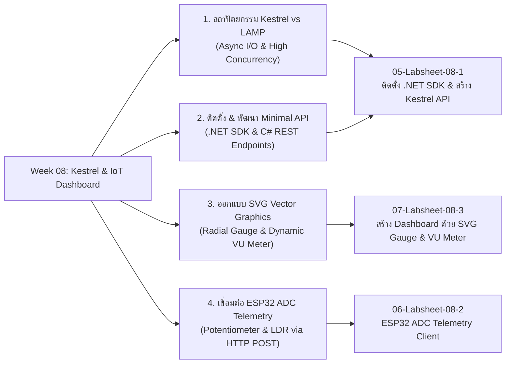

# Week 08: High-Performance Kestrel Web Server (.NET) vs LAMP Stack & ESP32 Dynamic SVG Telemetry Dashboard

## 1. บทนำ (Introduction)
ในสัปดาห์ที่ 8 นี้ เราจะเปลี่ยนผ่านจากการใช้สถาปัตยกรรมเว็บดั้งเดิมอย่าง **LAMP Stack (Linux, Apache, MySQL, PHP)** หรือ Web Server ขนาดเล็กบนตัวไมโครคอนโทรลเลอร์ มาสู่การใช้ **Kestrel Web Server (.NET 8/9)** ซึ่งเป็น Cross-platform Asynchronous High-Performance Web Server ระดับอุตสาหกรรมที่ถูกออกแบบมาเพื่อรองรับงาน I/O-bound High-Concurrency Telemetry ของระบบ IoT โดยเฉพาะ

นอกจากนี้ เราจะได้เรียนรู้การเชื่อมต่อระบบแบบ end-to-end ตั้งแต่การใช้ **ESP32** อ่านค่าสัญญาณแอนะล็อก **Potentiometer (ปรับค่าความต้านทาน)** และ **LDR (วัดความเข้มแสง)** ผ่านวงจร ADC 12-bit แล้วยิงข้อมูลเข้า REST API ผ่านโปรโตคอล HTTP POST/JSON และสร้างหน้า **Web Dashboard** ยุคใหม่ที่แสดงผลค่าสัญญาณแบบเรียลไทม์ด้วย **SVG Radial Gauge** (เกจวัดแบบเข็มไมล์) และ **Audio VU Meter** (มาตรวัดระดับแสงแบบหลอด LED)

---

## 2. แผนผังเนื้อหาการเรียนรู้ประจำสัปดาห์ (Lesson Roadmap)

---

## 3. รายการเอกสารบทเรียน (Lesson Materials)

1. **[01-Introduction-to-Kestrel-vs-LAMP.md](01-Introduction-to-Kestrel-vs-LAMP.md)** - เปรียบเทียบสถาปัตยกรรม LAMP Stack vs Kestrel (.NET Core), ระบบ Async Thread Pool, Libuv / Socket Layer และการเลือกใช้ Web Server สำหรับ IoT Telemetry
2. **[02-Dotnet-SDK-Setup-and-Minimal-API.md](02-Dotnet-SDK-Setup-and-Minimal-API.md)** - ขั้นตอนการติดตั้ง .NET SDK, คำสั่ง dotnet CLI, โครงสร้างโปรเจกต์ Minimal API, CORS Policy และการสร้าง In-Memory Telemetry Data Store
3. **[03-SVG-Gauge-and-VU-Meter-Design.md](03-SVG-Gauge-and-VU-Meter-Design.md)** - ทฤษฎีเวกเตอร์กราฟิก SVG, การคำนวณวงกลมโค้ง (`stroke-dasharray`, `stroke-dashoffset`), การหมุนเข็ม Gauge ด้วย Trigonometry และโครงสร้างหลอดไฟ LED ของ VU Meter
4. **[04-Glossary.md](04-Glossary.md)** - อภิธานศัพท์และคำย่อทางเทคนิคประจำสัปดาห์ที่ 8 (.NET SDK, Kestrel, Minimal API, ADC Oneshot, SVG Vector, VU Meter, Glassmorphism, CORS)

---

## 4. รายการใบงานปฏิบัติการประจำสัปดาห์ (Labsheets)

1. **[05-Labsheet-08-1-Dotnet-Kestrel-Setup.md](05-Labsheet-08-1-Dotnet-Kestrel-Setup.md)** - **ใบงานที่ 8.1** การตรวจสอบ/ติดตั้ง .NET SDK และการจับมือเขียน Kestrel Web Server ด้วย C# Minimal API
2. **[06-Labsheet-08-2-ESP32-ADC-HTTP-Client.md](06-Labsheet-08-2-ESP32-ADC-HTTP-Client.md)** - **ใบงานที่ 8.2** การต่อวงจร Potentiometer / LDR และเขียนโค้ด ESP32 (ESP-IDF / Arduino C++) อ่านค่า ADC ยิง HTTP POST เข้า Kestrel
3. **[07-Labsheet-08-3-SVG-Gauge-Dashboard.md](07-Labsheet-08-3-SVG-Gauge-Dashboard.md)** - **ใบงานที่ 8.3** การสร้างหน้าต่าง Web Dashboard แบบ Glassmorphism ที่ขับเคลื่อนด้วย SVG Radial Gauge และ Audio VU Meter แบบเรียลไทม์

---

## 5. สิ่งที่ต้องเตรียมก่อนเริ่มการทดลอง (Prerequisites)

* **คอมพิวเตอร์ผู้เรียน:**
  * Windows 10/11, macOS หรือ Linux
  * ติดตั้ง Visual Studio Code พร้อม Extension **C# Dev Kit** หรือ **C#**
  * ติดตั้ง **.NET 8.0 SDK** หรือใหม่กว่า
* **ฮาร์ดแวร์ & วงจร:**
  * บอร์ดไมโครคอนโทรลเลอร์ ESP32 พร้อมสาย USB
  * ตัวต้านทานปรับค่าได้ (Potentiometer / Rotary Volume) $10k\Omega$ จำนวน 1 ตัว
  * เซนเซอร์วัดแสง LDR (Light Dependent Resistor) จำนวน 1 ตัว
  * ตัวต้านทาน $10k\Omega$ (สำหรับทำ Voltage Divider ร่วมกับ LDR) จำนวน 1 ตัว
  * สายต่อ Breadboard (Jumper Wires)

### ตารางผังการต่ออุปกรณ์ (Hardware Pinout Table)

| อุปกรณ์ที่ต่อ | ขา ESP32 (GPIO) | ฟังก์ชัน / โหมดการทำงาน | ช่วงค่าสัญญาณ (Range) |
| :--- | :--- | :--- | :--- |
| **Potentiometer (ขากลาง)** | **GPIO 34** (ADC1_CH6) | แอนะล็อกอินพุต (ปรับเปลี่ยนแรงดันไฟฟ้า) | 0 - 4095 (0.00V - 3.30V) |
| **LDR Sensor (จุดแบ่งแรงดัน)** | **GPIO 35** (ADC1_CH7) | แอนะล็อกอินพุต (วัดความเข้มแสงสว่าง) | 0 - 4095 (0% - 100% Light) |
