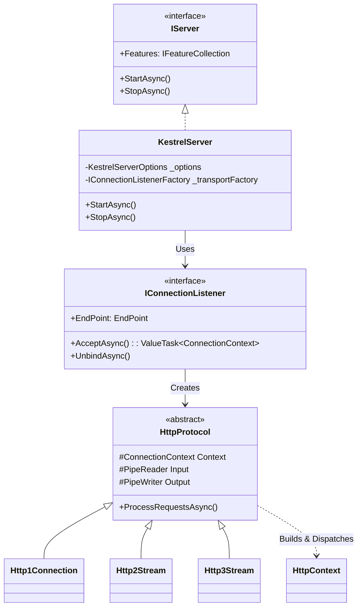
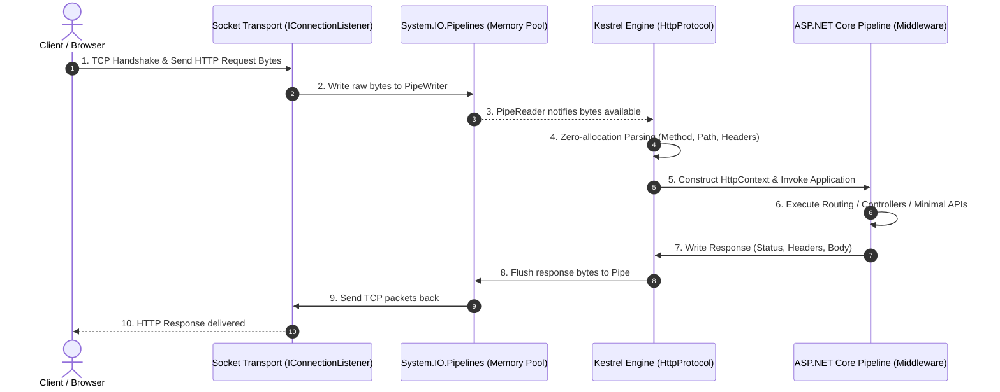
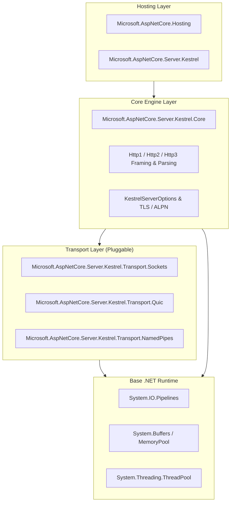
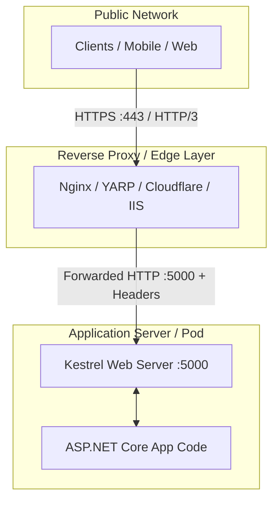

การอธิบายสถาปัตยกรรมของ **Kestrel Web Server** (Web Server หลักแบบ Cross-platform และประสิทธิภาพสูงของ ASP.NET Core) ผ่าน **4+1 Architectural View Model (Kruchten)** พร้อมแผนภาพ UML ในแต่ละมุมมอง มีรายละเอียดดังนี้ครับ:

---

### 1. Logical View (มุมมองเชิงตรรกะ)

> **เป้าหมาย:** แสดงโครงสร้าง Abstraction ภายใน, Classes, Interfaces และความสัมพันธ์ของ Core Components

Kestrel ถูกออกแบบตามสถาปัตยกรรม Interface-driven เพื่อให้ถอดเปลี่ยน Transport Layer หรือขยายการทำงานได้ง่าย

- **`IServer`**: Interface หลักของ ASP.NET Core Server
- **`KestrelServer` / `KestrelServerImpl`**: ตัวจัดการ Life-cycle ของ Kestrel
- **`IConnectionListenerFactory` & `IConnectionListener`**: คอย Bind พอร์ตและ Listen TCP/UNIX Socket
- **`HttpProtocol`**: ประมวลผลและแปลง Byte Streams เป็น HTTP Request/Response (รองรับ HTTP/1.1, HTTP/2, HTTP/3)
- **`HttpContext` & `IFeatureCollection`**: Context ส่งต่อไปยัง ASP.NET Core Middleware Pipeline

---

### 2. Process View (มุมมองกระบวนการและ Concurrency)

> **เป้าหมาย:** แสดงพฤติกรรมการทำงานขณะ Runtime, การจัดการ Threading, Non-blocking I/O และ Memory (`System.IO.Pipelines`)

Kestrel ใช้แนวทาง **Asynchronous Event-driven Non-blocking I/O** โดยใช้ `System.IO.Pipelines` เพื่อทำ **Zero-copy / Low-allocation**:

1. Socket Transport รับ TCP Connection และเขียน Raw Bytes ลงใน `Pipe`
2. Kestrel Parser (`HttpProtocol`) อ่าน Byte stream และ Parse Headers
3. สร้าง `HttpContext` และส่งเข้า Application Middleware Pipeline บน ThreadPool ของ .NET

---

### 3. Development View / Implementation View (มุมมองการพัฒนา)

> **เป้าหมาย:** แสดงโครงสร้าง Modules, Packages และ Layering ของ Source Code ใน .NET Runtime / ASP.NET Core

Kestrel แยก Layer ชัดเจนระหว่าง **Transport Layer**, **Protocol Engine Layer** และ **Hosting Layer**:

---

### 4. Physical / Deployment View (มุมมองทางกายภาพและการ Deploy)

> **เป้าหมาย:** แสดงว่า Kestrel วางอยู่ตรงไหนใน Network Topology เมื่อนำไปใช้งานจริง

Kestrel รองรับ 2 รูปแบบการ Deploy หลัก:

#### รูปแบบ A: Edge Server (Direct-facing)

Kestrel รับ Traffic ตรงจาก Internet โดยเปิด TLS, HTTP/2, HTTP/3 ด้วยตัวเอง (เหมาะกับ Microservices, gRPC, หรือสภาพแวดล้อม Containerized)

#### รูปแบบ B: Behind Reverse Proxy (Most Common for Enterprise)

อยู่หลัง Reverse Proxy (เช่น Nginx, Apache, IIS, Envoy, YARP หรือ Cloud Load Balancer) เพื่อจัดการ SSL Termination, Static Files, Rate Limiting และ Security Defense

---

### (+1) Use Case / Scenarios View (มุมมองการใช้งานหลัก)

- **High-throughput API / Microservices:** รับ Request ปริมาณมหาศาลด้วย Latency ต่ำและใช้ CPU/RAM น้อย
- **gRPC Server:** รองรับ HTTP/2 End-to-End และ Multiplexing สตรีมข้อมูล
- **Modern Web Standards (HTTP/3 over QUIC):** รองรับ Connection Migration และลด Head-of-Line Blocking ผ่าน UDP Transport

