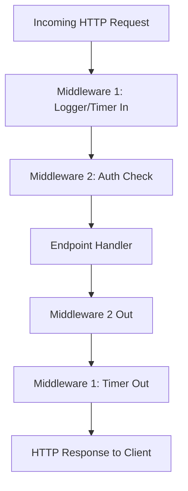

# ใบงานการทดลอง: Kestrel Web Server Step-by-Step
> **คู่มือการเรียนรู้เชิงลึก: จากพื้นฐานโครงสร้างภาษา สู่แกนการทำงานของ High-Performance Web Server**  
> *(เปรียบเทียบเชิงแนวคิดกับภาษา C: Header, Library, Entry Point, Socket และ Callback Functions)*

---

## 🎯 วัตถุประสงค์การทดลอง (Objectives)
1. เข้าใจโครงสร้างพื้นฐานของโปรเจกต์ .NET Core และสถาปัตยกรรมของ Kestrel Web Server
2. เข้าใจการเทียบเคียงแนวคิดระหว่าง **C Programming** กับ **Modern C# / Kestrel** (`#include` vs `using`, `Makefile` vs `.csproj`, `main()` vs `Top-level statements`, `socket()` vs `Kestrel Listeners`)
3. สามารถกำหนดค่า Socket Endpoints, Ports, Protocol (HTTP/1.1, HTTP/2) และ Server Limits ได้ด้วยตนเอง
4. เข้าใจกลไกการรับส่งข้อมูลผ่าน `HttpContext` (Headers, Request/Response, Buffer Streams)
5. สามารถเขียน Middleware (Pipeline Callback Functions) เพื่อควบคุมการไหลของข้อมูล HTTP ได้

---

## 🧭 ตารางเปรียบเทียบแนวคิด: C Language vs C# Kestrel

เพื่อให้เห็นภาพง่ายที่สุดเหมือนการเขียน `hello.c`:

| มิติการทำงาน | ภาษา C (POSIX / Socket Programming) | C# Kestrel Web Server |
| :--- | :--- | :--- |
| **Build Spec / Libs** | `Makefile` / `gcc -lws2_32 -I...` | `.csproj` (`<Project Sdk="Microsoft.NET.Sdk.Web">`) |
| **Header Files** | `#include <stdio.h>`, `#include <sys/socket.h>` | `using Microsoft.AspNetCore.Builder;`, `using Microsoft.AspNetCore.Hosting;` |
| **Entry Point** | `int main(int argc, char* argv[])` | `public static void Main(string[] args)` หรือ Top-Level statements |
| **Create & Bind Socket** | `socket()`, `bind()`, `listen()` | `options.ListenLocalhost(5000)` / `options.ListenAnyIP(...)` |
| **Event Loop / Accept** | `accept()` + `select()` / `epoll()` loop | `KestrelServer` + `System.IO.Pipelines` (Non-blocking I/O) |
| **Request / Response** | `char buffer[1024]; recv(); send();` | `HttpContext context` (`context.Request`, `context.Response`) |
| **Function Callback** | Function Pointer (`void (*handler)(int sock)`) | Request Delegate / Middleware (`async (context, next) => { ... }`) |

---

## 🛠️ สิ่งที่ต้องเตรียม (Prerequisites)
- ติดตั้ง **.NET SDK 8.0** หรือ **9.0** ขึ้นไป ([ดาวน์โหลด](https://dotnet.microsoft.com/download))
- Command Shell (PowerShell หรือ Bash)
- Web Browser หรือเครื่องมือทดสอบ API เช่น `curl`

---

## 🧪 LAB 1: เริ่มต้นสร้าง "Hello World" และผ่าโครงสร้างโปรเจกต์
**เป้าหมาย:** สร้าง Kestrel Server ที่สั้นที่สุด และทำความเข้าใจว่าคอมไพเลอร์เชื่อมโยง Library อย่างไร

### 1.1 คำสั่งสร้างโปรเจกต์ผ่าน Terminal
เปิด Terminal แล้วพิมพ์คำสั่ง:
```bash
# 1. สร้างโฟลเดอร์สำหรับโปรลอง
mkdir KestrelLab && cd KestrelLab

# 2. สร้างโปรเจกต์แบบ Web ที่ว่างเปล่า (Empty Web)
dotnet new web -n KestrelHello -o .
```

### 1.2 เจาะลึกไฟล์ `.csproj` (เทียบเท่า `Makefile` / Compiler Flags ใน C)
เปิดดูไฟล์ `KestrelHello.csproj`:
```xml
<Project Sdk="Microsoft.NET.Sdk.Web">
  <PropertyGroup>
    <TargetFramework>net8.0</TargetFramework>
    <Nullable>enable</Nullable>
    <ImplicitUsings>enable</ImplicitUsings>
  </PropertyGroup>
</Project>
```

> 🔍 **คำอธิบาย Library & Headers:**
> - `Sdk="Microsoft.NET.Sdk.Web"`: เปรียบเหมือนการ Link Library `-l` ทั้งหมดของ Web Server (Kestrel, Routing, Pipelines) เข้ามาในโปรเจกต์โดยอัตโนมัติ
> - `<ImplicitUsings>enable</ImplicitUsings>`: เทียบเท่ากับการแอบ `#include` standard headers ที่ใช้บ่อยๆ (เช่น `System`, `System.Threading.Tasks`) ไว้ที่หัวไฟล์ล่วงหน้า

---

## 🧪 LAB 2: เปิดกล่องเวทมนตร์ — จาก Top-Level สู่ Classic `main()`
เพื่อทำความเข้าใจ Header และ Function ต่างๆ อย่างแท้จริง เราจะเขียน `Program.cs` แบบดั้งเดิม (Explicit C-style) โดยไม่ใช้ Syntax ย่อ

### 2.1 โค้ดทดลอง (`Program.cs`)
แทนที่โค้ดใน `Program.cs` ด้วยโค้ดด้านล่างนี้:

```csharp
// ============================================================================
// 1. HEADERS & NAMESPACES (เทียบเท่า #include ใน C)
// ============================================================================
using System;
using System.Threading.Tasks;
using Microsoft.AspNetCore.Builder;      // บรรจุ WebApplication, WebApplicationBuilder
using Microsoft.AspNetCore.Hosting;      // บรรจุ Kestrel Hosting Extension Methods
using Microsoft.AspNetCore.Http;         // บรรจุ HttpContext, HttpRequest, HttpResponse
using Microsoft.Extensions.Hosting;      // บรรจุ Host Lifecycle Management
using Microsoft.AspNetCore.Server.Kestrel.Core; // บรรจุ KestrelServerOptions

namespace KestrelLab
{
    // ========================================================================
    // 2. ENTRY POINT CLASS (เทียบเท่าไฟล์ main.c)
    // ========================================================================
    public class Program
    {
        // ฟังก์ชัน main จุดเริ่มต้นของโปรเซส
        public static async Task Main(string[] args)
        {
            Console.WriteLine("[INFO] Starting Kestrel Web Server...");

            // Step A: สร้าง Builder เพื่อจัดเตรียม Configuration & DI Container
            WebApplicationBuilder builder = WebApplication.CreateBuilder(args);

            // Step B: คอนฟิก Kestrel Server โดยตรง (Socket & Protocols)
            builder.WebHost.ConfigureKestrel((WebHostBuilderContext context, KestrelServerOptions options) =>
            {
                // สั่งให้ Kestrel Bind TCP Socket ที่ Port 5000 (เทียบเท่า socket -> bind -> listen)
                options.ListenLocalhost(5000, listenOptions =>
                {
                    listenOptions.Protocols = HttpProtocols.Http1AndHttp2;
                    Console.WriteLine("[NET] Listening on http://localhost:5000 (HTTP/1.1, HTTP/2)");
                });
            });

            // Step C: Build เพื่อเปลี่ยนสถานะเป็น Server Instance ที่พร้อมทำงาน
            WebApplication app = builder.Build();

            // Step D: กำหนด Routing และ Request Handler Function
            // เทียบเท่าฟังก์ชัน Callback รับ HTTP Request แล้วส่ง Response กลับ
            app.MapGet("/", async (HttpContext context) =>
            {
                // ควบคุม Header และ Output Stream
                context.Response.ContentType = "text/plain; charset=utf-8";
                await context.Response.WriteAsync("Hello World from Bare-Metal Kestrel!");
            });

            // Step E: เข้าสู่ Event Loop ทำงานค้างไว้จนกว่าจะกด Ctrl+C
            await app.RunAsync();
        }
    }
}
```

### 2.2 การทดสอบรัน
```bash
dotnet run
```
เปิด Browser หรือรัน `curl` ในอีกหน้าต่างหนึ่ง:
```bash
curl http://localhost:5000
```
**ผลลัพธ์ที่ได้:**
```text
Hello World from Bare-Metal Kestrel!
```

---

## 🧪 LAB 3: เจาะลึก `HttpContext` (เทียบเคียง Request/Response Buffers)
ในภาษา C เมื่อเรา `recv()` ข้อมูลจาก Socket เราต้องแกะ String ของ HTTP Header ด้วยตนเอง ใน Kestrel ข้อมูลทั้งหมดจะถูก Parse และจัดเก็บลงในออบเจ็กต์ `HttpContext`

### 3.1 เพิ่ม Route ตรวจสอบ Request Headers และ Query String
เพิ่มโค้ด Route ต่อไปนี้ใน `Program.cs` (ก่อนคำสั่ง `app.RunAsync()`):

```csharp
// Route ทดสอบการอ่าน Request Header และ Query Parameter
app.MapGet("/inspect", async (HttpContext context) =>
{
    // 1. การอ่าน Query String: /inspect?name=Alice
    string userName = context.Request.Query["name"].ToString();
    if (string.IsNullOrEmpty(userName))
    {
        userName = "Anonymous";
    }

    // 2. การอ่าน HTTP Headers ที่ Client ส่งมา
    string userAgent = context.Request.Headers["User-Agent"].ToString();
    string clientIp = context.Connection.RemoteIpAddress?.ToString() ?? "Unknown";

    // 3. การเขียน Custom Response Header กลับไป
    context.Response.Headers.Append("X-Server-Engine", "Kestrel-Custom-Core");
    context.Response.StatusCode = StatusCodes.Status200OK; // HTTP 200

    // 4. ส่งข้อความแบบ JSON หรือ Text
    string responseMessage = 
        $"=== Kestrel Inspector ===\n" +
        $"Greeting: Hello, {userName}!\n" +
        $"Client IP: {clientIp}\n" +
        $"User-Agent: {userAgent}\n" +
        $"Protocol: {context.Request.Protocol}\n";

    context.Response.ContentType = "text/plain; charset=utf-8";
    await context.Response.WriteAsync(responseMessage);
});
```

### 3.2 การทดสอบ
รันคำสั่ง:
```bash
curl -i "http://localhost:5000/inspect?name=Engineer"
```
**สังเกตผลลัพธ์:**
- ดู HTTP Status Code: `HTTP/1.1 200 OK`
- ดู Header: `X-Server-Engine: Kestrel-Custom-Core`
- ดู Body ที่ Kestrel ตอบกลับมา

---

## 🧪 LAB 4: Middleware Pipeline — Chained Function Pointers
ใน C เมื่อมีฟังก์ชันตัวกรอง (Filter Chain) เราจะใช้ Function Pointer ส่งต่อไปเรื่อยๆ ใน ASP.NET Core เราเรียกว่า **Middleware Pipeline**



### 4.1 เพิ่ม Middleware จับเวลา (Execution Latency Filter)
เพิ่มโค้ดก่อนบรรทัด `app.MapGet(...)`:

```csharp
// Middleware 1: วัดระยะเวลาการประมวลผล (Benchmarking Middleware)
app.Use(async (HttpContext context, Func<Task> next) =>
{
    var stopwatch = System.Diagnostics.Stopwatch.StartNew();

    Console.WriteLine($"--> [INCOMING] {context.Request.Method} {context.Request.Path}");

    // เรียกฟังก์ชันถัดไปใน Pipeline (Chained Callback)
    await next.Invoke();

    stopwatch.Stop();
    Console.WriteLine($"<-- [OUTGOING] {context.Request.Path} completed in {stopwatch.ElapsedMilliseconds} ms (Status: {context.Response.StatusCode})");
});
```

### 4.2 การทดสอบ
เปิด Browser หรือรัน `curl http://localhost:5000/inspect` แล้วสังเกต Log บนหน้าต่าง Terminal ของ Server:
```text
--> [INCOMING] GET /inspect
<-- [OUTGOING] /inspect completed in 1 ms (Status: 200)
```

---

## 🧪 LAB 5: การปรับแต่งระดับระบบ (Low-Level Systems Tuning)
Kestrel โดดเด่นในเรื่องความเร็วสูงเพราะทำงานใกล้ชิดกับ Socket ในระดับ OS ในแล็บนี้เราจะทดลองตั้งค่า **Socket Limits** และ **Connection Controls**

### 5.1 ปรับแต่ง Server Limits ใน `ConfigureKestrel`
กลับไปแก้ไขบล็อก `builder.WebHost.ConfigureKestrel` ใน `Program.cs`:

```csharp
builder.WebHost.ConfigureKestrel((context, options) =>
{
    // กำหนด Port และ Binding
    options.ListenAnyIP(5000, listenOpts =>
    {
        listenOpts.Protocols = HttpProtocols.Http1AndHttp2;
    });

    // ========================================================================
    // SYSTEMS TUNING & CONSTRAINTS (การควบคุมทรัพยากรระดับ OS)
    // ========================================================================
    
    // 1. จำกัดขนาด Request Body สูงสุด (ป้องกัน Denial of Service จาก Payload ขนาดยักษ์)
    options.Limits.MaxRequestBodySize = 10 * 1024 * 1024; // 10 MB

    // 2. จำกัดจำนวน Concurrent Connections
    options.Limits.MaxConcurrentConnections = 100;
    options.Limits.MaxConcurrentUpgradedConnections = 100; // สำหรับ WebSocket

    // 3. กำหนด Keep-Alive Timeout ของ TCP Socket
    options.Limits.KeepAliveTimeout = TimeSpan.FromMinutes(2);

    // 4. กำหนดอัตราการส่งข้อมูลขั้นต่ำ (ป้องกัน Slowloris Attack)
    options.Limits.MinRequestBodyDataRate = new MinDataRate(bytesPerSecond: 100, gracePeriod: TimeSpan.FromSeconds(10));

    Console.WriteLine("[CONFIG] Kestrel limits configured successfully.");
});
```

---

## 📝 แบบฝึกหัดและคำถามท้ายการทดลอง (Review & Checkpoint)

1. **เปรียบเทียบ `#include` กับ `using`:**  
   ทำไมการประกาศ `using Microsoft.AspNetCore.Http;` จึงยังไม่เพียงพอหากใน `.csproj` ไม่ได้ระบุ `Sdk="Microsoft.NET.Sdk.Web"`?
2. **การทำงานของ `await next.Invoke()` ใน Middleware:**  
   หากใน Middleware บรรทัดที่ 4.1 เราลบคำสั่ง `await next.Invoke();` ออก จะเกิดผลลัพธ์อย่างไรกับ Client ที่ส่ง Request เข้ามา?
3. **การประยุกต์กับฮาร์ดแวร์ / IoT (STM32 / ESP32):**  
   หากต้องการให้ Kestrel รับข้อมูล Telemetry จาก Serial Port (USB) แล้วส่งต่อให้ Browser แบบ Real-Time เราควรนำ Service อ่าน Serial Port ไปไว้ที่ส่วนใดของ Lifecycle (เทียบกับ Lab 2)? *(ใบ้: พิจารณา BackgroundService / HostedService)*

---

## 📋 สรุปสาระสำคัญ
- **Kestrel** ไม่ใช่แค่ Web Server ทั่วไป แต่เป็น **Asynchronous Event-driven Socket Engine** ที่มีประสิทธิภาพสูงเทียบเท่า C-based event loops (เช่น libuv / epoll)
- **`WebApplicationBuilder`** ทำหน้าที่เป็น Configuration Assembler สำหรับเตรียม Library และ Socket
- **`HttpContext`** เป็นศูนย์กลางรวบรวม Buffers และ Metadata ของการสนทนาระดับ HTTP Protocol
- **Middleware** คือ Chained Callbacks ที่ยืดหยุ่นสูง เปิดโอกาสให้เราเขียน Logic ดักจับ ตรวจสอบ หรือดัดแปลง Byte Streams ได้อย่างอิสระ
