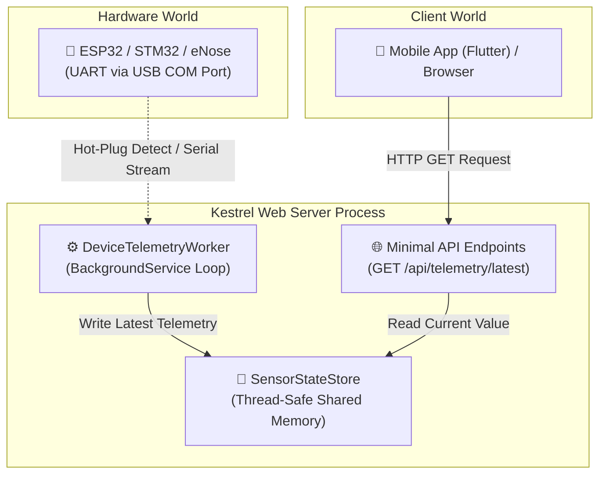

# ใบงานการทดลองที่ 3 (Lab 03): Hardware Serial Bridge & Background Worker
> **โครงการ LabBuddy: สะพานเชื่อมฮาร์ดแวร์จริง (ESP32/STM32) เข้าสู่ Kestrel Server**  
> *(พร้อมฟังก์ชัน Auto-Detect พอร์ต USB และ Fallback Simulation Mode เพื่อให้พัฒนาแอปต่อได้แม้วันที่ไม่มีบอร์ด)*

---

## 🎯 วัตถุประสงค์การทดลอง (Objectives)
1. เข้าใจสถาปัตยกรรม **`BackgroundService` (IHostedService)** ของ .NET สำหรับงานประมวลผลเบื้องหลัง (Background Worker)
2. สามารถติดตั้งและใช้งานไลบรารี `System.IO.Ports` เพื่อสื่อสารกับฮาร์ดแวร์ผ่าน USB Virtual COM Port (UART)
3. เข้าใจและเขียนระบบ **Dual-Mode (Auto-Detect & Fallback Simulation)**:
   - เสียบสาย USB $\rightarrow$ อ่านค่าจริงจากฮาร์ดแวร์ (Live Hardware Mode)
   - ถอดสาย หรือยังไม่มีบอร์ด $\rightarrow$ สลับเป็นโหมดจำลองคลื่นเซนเซอร์ (Simulation Mode) อัตโนมัติ เพื่อไม่ให้ทีม Flutter ต้องรองาน
4. สามารถส่งข้อมูลจาก Background Thread ไปพักไว้ที่ **Shared Memory Store (Thread-safe State)** เพื่อให้ API ดึงไปใช้งานต่อได้

---

## 🧭 แผนผังสถาปัตยกรรมภายใน Kestrel Gateway



---

## 🛠️ อุปกรณ์และซอฟต์แวร์ที่ต้องใช้
- เครื่องคอมพิวเตอร์ที่ติดตั้ง **.NET SDK 8.0** หรือ **9.0**
- บอร์ด ESP32 หรือ STM32 พร้อมสาย USB *(หากไม่มีบอร์ด สามารถทดสอบผ่านโหมดจำลองได้ 100%)*
- แพ็กเกจ NuGet: `System.IO.Ports`

---

## 🧪 ขั้นตอนที่ 1: การสร้างโปรเจกต์และติดตั้งไลบรารี SerialPort
เปิด Terminal แล้วรันคำสั่ง:

```bash
# 1. สร้างโฟลเดอร์สำหรับ Lab 3
mkdir LabBuddy_Lab03 && cd LabBuddy_Lab03

# 2. สร้างโปรเจกต์แบบ Web API
dotnet new web -o .

# 3. ติดตั้ง Package สำหรับอ่าน Serial Port ของระบบปฏิบัติการ
dotnet add package System.IO.Ports
```

---

## 🧪 ขั้นตอนที่ 2: สร้าง Data Model และ Shared Memory Store
สร้างที่พักข้อมูล (In-Memory State Store) เพื่อเป็นสะพานเชื่อมระหว่าง Background Worker (ตัวอ่าน USB) กับ Web API (ตัวส่งข้อมูล)

เปิดไฟล์ `Program.cs` แล้วเขียนโครงสร้างข้อมูลด้านบน:

```csharp
using System;
using System.IO.Ports;
using System.Threading;
using System.Threading.Tasks;
using Microsoft.AspNetCore.Builder;
using Microsoft.AspNetCore.Http;
using Microsoft.Extensions.DependencyInjection;
using Microsoft.Extensions.Hosting;
using Microsoft.Extensions.Logging;

// ============================================================================
// 1. DATA MODEL & THREAD-SAFE STATE STORE
// ============================================================================
public record TelemetryData(
    string DeviceId,
    DateTime Timestamp,
    double Temperature,
    double Humidity,
    int GasAdc,
    string Mode,     // "LIVE_HARDWARE" หรือ "SIMULATION"
    string PortName  // เช่น "COM3" หรือ "Virtual"
);

// คลาสเก็บสถานะล่าสุดใน RAM เพื่อให้ API อ่านได้ตลอดเวลา
public class SensorStateStore
{
    private TelemetryData _current = new TelemetryData(
        DeviceId: "Init",
        Timestamp: DateTime.UtcNow,
        Temperature: 0,
        Humidity: 0,
        GasAdc: 0,
        Mode: "WAITING",
        PortName: "None"
    );

    // ฟังก์ชันอัปเดตข้อมูล (Thread-safe assignment)
    public void Update(TelemetryData data) => _current = data;

    // ฟังก์ชันอ่านข้อมูลล่าสุด
    public TelemetryData GetLatest() => _current;
}
```

---

## 🧪 ขั้นตอนที่ 3: สร้าง Background Worker (Dual-Mode Serial Ingress)
เขียนคลาส `DeviceTelemetryWorker` ซึ่งจะทำงานเบื้องหลังแบบ Non-blocking ตลอดเวลาที่ Kestrel รันอยู่:

```csharp
// ============================================================================
// 2. BACKGROUND WORKER: SERIAL INGRESS & SIMULATION ENGINE
// ============================================================================
public class DeviceTelemetryWorker : BackgroundService
{
    private readonly SensorStateStore _store;
    private readonly ILogger<DeviceTelemetryWorker> _logger;
    private SerialPort? _serialPort;
    private double _simAngle = 0;

    public DeviceTelemetryWorker(SensorStateStore store, ILogger<DeviceTelemetryWorker> logger)
    {
        _store = store;
        _logger = logger;
    }

    protected override async Task ExecuteAsync(CancellationToken stoppingToken)
    {
        _logger.LogInformation("[WORKER] Telemetry Engine Started.");

        while (!stoppingToken.IsCancellationRequested)
        {
            // 1. ตรวจหาพอร์ต USB Serial (Auto-Detect)
            if (_serialPort == null || !_serialPort.IsOpen)
            {
                TryConnectHardware();
            }

            // ================== CASE A: บอร์ดเชื่อมต่ออยู่ (LIVE MODE) ==================
            if (_serialPort != null && _serialPort.IsOpen)
            {
                try
                {
                    if (_serialPort.BytesToRead > 0)
                    {
                        // อ่านบรรทัดข้อมูลจาก ESP32 (เช่น "27.5,60.2,1890")
                        string line = _serialPort.ReadLine().Trim();
                        string[] parts = line.Split(',');

                        if (parts.Length >= 3 &&
                            double.TryParse(parts[0], out double temp) &&
                            double.TryParse(parts[1], out double hum) &&
                            int.TryParse(parts[2], out int adc))
                        {
                            var liveData = new TelemetryData("ESP32-Live", DateTime.UtcNow, temp, hum, adc, "LIVE_HARDWARE", _serialPort.PortName);
                            _store.Update(liveData);
                        }
                    }
                }
                catch (Exception ex)
                {
                    _logger.LogWarning("[SERIAL] Disconnected: {Msg}", ex.Message);
                    ClosePort();
                }
            }
            // ================== CASE B: ยังไม่เสียบบอร์ด (SIMULATION MODE) ==================
            else
            {
                _simAngle += 0.1;
                // คำนวณคลื่น Sine Wave จำลองค่า
                var simData = new TelemetryData(
                    DeviceId: "eNose-Simulator",
                    Timestamp: DateTime.UtcNow,
                    Temperature: Math.Round(26.0 + 3.0 * Math.Sin(_simAngle), 2),
                    Humidity: Math.Round(55.0 + 5.0 * Math.Cos(_simAngle), 2),
                    GasAdc: (int)(1800 + 400 * Math.Sin(_simAngle * 1.5)),
                    Mode: "SIMULATION",
                    PortName: "Virtual-Loop"
                );
                _store.Update(simData);
                await Task.Delay(200, stoppingToken); // อัปเดตข้อมูลจำลองทุกๆ 200 ms
            }

            await Task.Delay(20, stoppingToken); // พักลูปเล็กน้อยเพื่อไม่ให้กิน CPU
        }

        ClosePort();
    }

    private void TryConnectHardware()
    {
        string[] ports = SerialPort.GetPortNames();
        if (ports.Length > 0)
        {
            try
            {
                string targetPort = ports[0]; // เลือกพอร์ตแรกที่ตรวจพบ
                _serialPort = new SerialPort(targetPort, 115200)
                {
                    ReadTimeout = 500,
                    WriteTimeout = 500
                };
                _serialPort.Open();
                _logger.LogInformation(">>> [HARDWARE CONNECTED] Bound to {Port} at 115200 baud.", targetPort);
            }
            catch (Exception ex)
            {
                _logger.LogDebug("[CONNECT ERR] Could not open port: {Err}", ex.Message);
                ClosePort();
            }
        }
    }

    private void ClosePort()
    {
        try { _serialPort?.Dispose(); } catch { }
        _serialPort = null;
    }
}
```

---

## 🧪 ขั้นตอนที่ 4: ประกอบ Server และเปิด API ให้บริการ
เขียนฟังก์ชันเริ่มต้นโปรแกรมใน `Program.cs`:

```csharp
// ============================================================================
// 3. SERVICE REGISTRATION & PIPELINE
// ============================================================================
var builder = WebApplication.CreateBuilder(args);

// ลงทะเบียน State Store เป็น Singleton (มีตัวเดียวตลอดชีวิตโปรแกรม)
builder.Services.AddSingleton<SensorStateStore>();

// ลงทะเบียน Background Worker ให้รันเป็น Service เบื้องหลัง
builder.Services.AddHostedService<DeviceTelemetryWorker>();

// เปิดใช้งาน CORS
builder.Services.AddCors(opts => opts.AddDefaultPolicy(p => p.AllowAnyOrigin().AllowAnyHeader().AllowAnyMethod()));

var app = builder.Build();
app.UseCors();

// Endpoint ดึงค่าล่าสุด (ดึงจาก State Store ใน RAM ไม่บล็อกการอ่านพอร์ต)
app.MapGet("/api/telemetry/current", (SensorStateStore store) =>
{
    return Results.Ok(store.GetLatest());
});

app.Run("http://localhost:5000");
```

---

## 🧪 ขั้นตอนที่ 5: การทดสอบและการสังเกตผล (Verification)

### 5.1 ทดสอบโหมดจำลอง (เมื่อยังไม่ได้เสียบบอร์ด)
1. สั่งรันโปรแกรม:
   ```bash
   dotnet run
   ```
2. เปิด Browser หรือเรียกคำสั่ง:
   ```bash
   curl http://localhost:5000/api/telemetry/current
   ```
3. สังเกต JSON ตอบกลับ:
   ```json
   {
     "deviceId": "eNose-Simulator",
     "temperature": 27.84,
     "humidity": 58.12,
     "gasAdc": 2145,
     "mode": "SIMULATION",
     "portName": "Virtual-Loop"
   }
   ```
   *จะเห็นว่าค่าตัวเลขเปลี่ยนไปเรื่อย ๆ ตามกราฟ Sine Wave ทำให้เพื่อนฝั่ง Flutter สามารถเอาไปเขียน UI วาดกราฟได้ทันทีโดยไม่ต้องรอง้อฮาร์ดแวร์!*

### 5.2 ทดสอบโหมดฮาร์ดแวร์จริง (เมื่อเสียบ ESP32/STM32)
1. เขียนโค้ดบน ESP32 ให้ส่งข้อมูลผ่าน Serial ออกมาบรรทัดละ 3 ค่าคั่นด้วยจุลภาค:
   ```cpp
   // ตัวอย่างโค้ดบน ESP32 / Arduino
   void setup() {
       Serial.begin(115200);
   }
   void loop() {
       float temp = 28.5;
       float hum = 62.0;
       int adcVal = analogRead(34);
       Serial.printf("%.1f,%.1f,%d\n", temp, hum, adcVal);
       delay(100);
   }
   ```
2. เสียบสาย USB เข้าเครื่องคอมพิวเตอร์
3. สังเกตข้อความบน Terminal ของ Kestrel:
   ```text
   >>> [HARDWARE CONNECTED] Bound to COM3 at 115200 baud.
   ```
4. เรียก `curl http://localhost:5000/api/telemetry/current` อีกครั้ง จะเห็น `"mode": "LIVE_HARDWARE"` ทันที

---

## 🎯 ภารกิจท้าทายประจำแล็บ (Lab Challenge)
- ให้นักศึกษาทดลองดึงสาย USB ออกขณะที่เซิร์ฟเวอร์ยังรันอยู่ แล้วสังเกตว่า Kestrel เกิดแครช (Crash) หรือไม่ และระบบสามารถสลับกลับเข้าสู่ `SIMULATION` ได้อย่างราบรื่นหรือไม่
