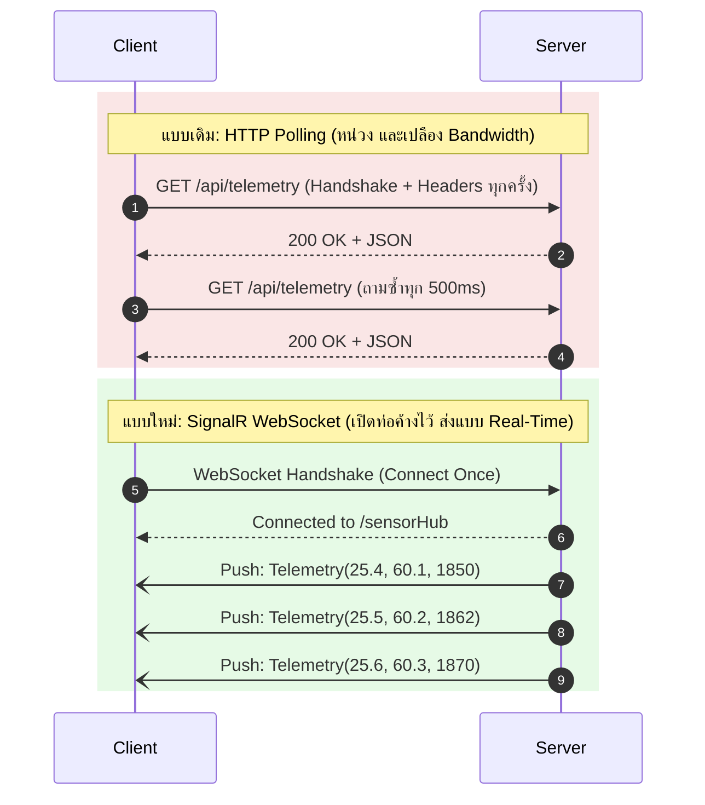

# ใบงานการทดลองที่ 4 (Lab 04): Real-Time Streaming via SignalR WebSockets
> **โครงการ LabBuddy: เปลี่ยนจากการ Polling สู่การยิงข้อมูลสดความถี่สูงระดับมิลลิวินาที**  
> *(ไม่ต้องกด Refresh หน้าจออีกต่อไป: Server ยิงข้อมูลเข้าสู่หน้าจอ Client โดยตรงทันทีที่มีค่าใหม่)*

---

## 🎯 วัตถุประสงค์การทดลอง (Objectives)
1. เข้าใจข้อจำกัดของการดึงข้อมูลแบบ **HTTP Polling** (`GET` ซ้ำๆ) เทียบกับ **WebSocket / Persistent Connection**
2. สามารถสร้างและกำหนดค่า **SignalR Hub** บน Kestrel Web Server
3. สามารถส่งข้อมูลจาก `BackgroundService` (ตัวอ่านเซนเซอร์จาก Lab 3) เข้าสู่ SignalR Hub โดยใช้ `IHubContext<SensorHub>`
4. สามารถเปิดฟังก์ชัน Static Web Page เพื่อแสดงผลกราฟคลื่นสัญญาณสดบน Web Browser สำหรับทดสอบก่อนส่งต่อให้ทีม Flutter

---

## 🧭 เปรียบเทียบ: HTTP Polling vs SignalR WebSocket



---

## 🛠️ อุปกรณ์และซอฟต์แวร์ที่ต้องใช้
- โค้ดต่อเนื่องจาก Lab 3 หรือสร้างโปรเจกต์ใหม่ใน Lab นี้
- เว็บบราวเซอร์ (Chrome, Edge หรือ Firefox)
- ไม่ต้องลง Package เพิ่มเติม! SignalR ถูกรวมอยู่ใน `Microsoft.NET.Sdk.Web` มาแล้ว

---

## 🧪 ขั้นตอนที่ 1: การสร้างโปรเจกต์
เปิด Terminal แล้วรันคำสั่ง:
```bash
# 1. สร้างโฟลเดอร์สำหรับ Lab 4
mkdir LabBuddy_Lab04 && cd LabBuddy_Lab04

# 2. สร้างโปรเจกต์เว็บ
dotnet new web -o .
```

---

## 🧪 ขั้นตอนที่ 2: สร้าง SignalR Hub (ท่อส่งข้อมูล)
SignalR ใช้คลาสที่สืบทอดจาก `Hub` ทำหน้าที่เป็นชุมสายสลับสัญญาณ

เปิดไฟล์ `Program.cs` แล้วเขียนนิยาม Hub:

```csharp
using System;
using System.Threading;
using System.Threading.Tasks;
using Microsoft.AspNetCore.Builder;
using Microsoft.AspNetCore.SignalR;
using Microsoft.Extensions.DependencyInjection;
using Microsoft.Extensions.Hosting;

// ============================================================================
// 1. DATA MODEL & SIGNALR HUB
// ============================================================================
public record SensorPacket(
    string DeviceId,
    DateTime Timestamp,
    double Temperature,
    double Humidity,
    int GasAdc,
    string Mode
);

// ชุมสาย SignalR (เหมือนห้องแชทของเซนเซอร์)
public class SensorHub : Hub
{
    // เมื่อมี Client (เช่น Flutter หรือ Browser) เชื่อมต่อเข้ามา
    public override async Task OnConnectedAsync()
    {
        Console.WriteLine($"[HUB] Client connected: {Context.ConnectionId}");
        await base.OnConnectedAsync();
    }

    public override async Task OnDisconnectedAsync(Exception? exception)
    {
        Console.WriteLine($"[HUB] Client disconnected: {Context.ConnectionId}");
        await base.OnDisconnectedAsync(exception);
    }
}
```

---

## 🧪 ขั้นตอนที่ 3: ให้ Background Worker ยิงข้อมูลเข้าสู่ Hub
ใน `BackgroundService` เราสามารถฉีด (Inject) `IHubContext<SensorHub>` เพื่อบรอดแคสต์ข้อมูลออกไปยังไคลเอนต์ทุกคน:

```csharp
// ============================================================================
// 2. BROADCASTING WORKER
// ============================================================================
public class TelemetryBroadcaster : BackgroundService
{
    private readonly IHubContext<SensorHub> _hub;
    private double _angle = 0;

    public TelemetryBroadcaster(IHubContext<SensorHub> hub)
    {
        _hub = hub;
    }

    protected override async Task ExecuteAsync(CancellationToken stoppingToken)
    {
        while (!stoppingToken.IsCancellationRequested)
        {
            _angle += 0.15;

            // สร้างข้อมูลจำลอง (หรือดึงจากพอร์ต USB จาก Lab 3)
            var packet = new SensorPacket(
                DeviceId: "eNose-Broadcaster",
                Timestamp: DateTime.UtcNow,
                Temperature: Math.Round(25.0 + 4.0 * Math.Sin(_angle), 2),
                Humidity: Math.Round(50.0 + 10.0 * Math.Cos(_angle), 2),
                GasAdc: (int)(2000 + 800 * Math.Sin(_angle * 2)),
                Mode: "STREAMING"
            );

            // บรอดแคสต์ข้อมูลไปยังไคลเอนต์ทั้งหมดที่กำลังฟัง Event "OnReceiveTelemetry"
            await _hub.Clients.All.SendAsync("OnReceiveTelemetry", packet, stoppingToken);

            // ส่งข้อมูลด้วยความถี่ 10 Hz (ทุกๆ 100 ms)
            await Task.Delay(100, stoppingToken);
        }
    }
}
```

---

## 🧪 ขั้นตอนที่ 4: เปิดใช้งาน SignalR และทำ Web Test Dashboard
เขียนส่วนการคอนฟิก Service และเปิดหน้าเว็บ HTML ทดสอบในตัว:

```csharp
// ============================================================================
// 3. SERVER SETUP & HTML CLIENT
// ============================================================================
var builder = WebApplication.CreateBuilder(args);

// ลงทะเบียน SignalR Service
builder.Services.AddSignalR();
builder.Services.AddHostedService<TelemetryBroadcaster>();

// เปิด CORS สำหรับ Flutter
builder.Services.AddCors(opts => opts.AddDefaultPolicy(p =>
    p.AllowAnyHeader().AllowAnyMethod().SetIsOriginAllowed(_ => true).AllowCredentials()));

var app = builder.Build();
app.UseCors();

// เชื่อมโยงเส้นทาง Hub
app.MapHub<SensorHub>("/sensorHub");

// สร้างหน้าเว็บ HTML ทดสอบในตัว (เสิร์ฟที่หน้าแรก "/")
app.MapGet("/", () => Results.Content(@"
<!DOCTYPE html>
<html>
<head>
    <title>LabBuddy Real-Time Monitor</title>
    <script src='https://cdnjs.cloudflare.com/ajax/libs/microsoft-signalr/8.0.0/signalr.min.js'></script>
    <style>
        body { font-family: sans-serif; background: #121212; color: #fff; text-align: center; padding: 40px; }
        .card { background: #1e1e1e; display: inline-block; padding: 25px 40px; border-radius: 12px; border: 1px solid #333; margin: 10px; }
        .value { font-size: 42px; font-weight: bold; color: #00e676; margin: 10px 0; }
        .badge { background: #333; padding: 4px 12px; border-radius: 20px; font-size: 14px; }
    </style>
</head>
<body>
    <h1>🔬 LabBuddy Telemetry Stream</h1>
    <div id='status' class='badge'>Connecting to Kestrel Hub...</div>
    <br><br>
    <div class='card'><div>TEMPERATURE</div><div id='temp' class='value'>--</div><div>&deg;C</div></div>
    <div class='card'><div>HUMIDITY</div><div id='hum' class='value'>--</div><div>%RH</div></div>
    <div class='card'><div>GAS ADC (eNose)</div><div id='gas' class='value'>--</div><div>Raw Units</div></div>

    <script>
        const connection = new signalR.HubConnectionBuilder()
            .withUrl('/sensorHub')
            .withAutomaticReconnect()
            .build();

        connection.on('OnReceiveTelemetry', data => {
            document.getElementById('temp').innerText = data.temperature.toFixed(1);
            document.getElementById('hum').innerText = data.humidity.toFixed(1);
            document.getElementById('gas').innerText = data.gasAdc;
        });

        connection.start()
            .then(() => {
                document.getElementById('status').innerText = '🟢 Connected Live to Kestrel SignalR';
                document.getElementById('status').style.background = '#1b5e20';
            })
            .catch(err => console.error(err));
    </script>
</body>
</html>
", "text/html"));

app.Run("http://localhost:5000");
```

---

## 🧪 ขั้นตอนที่ 5: การทดสอบและการสังเกตผล (Verification)

1. รันเซิร์ฟเวอร์:
   ```bash
   dotnet run
   ```
2. เปิด Google Chrome หรือ Edge แล้วไปที่:
   ```text
   http://localhost:5000/
   ```
3. **สังเกตหน้าจอ:**
   - ตัวเลข Temperature, Humidity และ Gas ADC จะวิ่งขยับอย่างต่อเนื่องที่ความเร็ว 10 ครั้งต่อวินาที (100 ms) โดยที่หน้าบราวเซอร์ **ไม่ต้องกด F5 หรือ Refresh เลยแม้แต่ครั้งเดียว!**
   - ตรวจสอบบนหน้าต่าง Terminal ของเซิร์ฟเวอร์ จะเห็น Log ขึ้นว่า:
     ```text
     [HUB] Client connected: xYz1234_abc...
     ```

---

## 🎯 ภารกิจท้าทายประจำแล็บ (Lab Challenge)
- ให้นักศึกษาทดลองเปิดหน้าต่างบราวเซอร์พร้อมกัน 3 หน้าต่าง แล้วสังเกตว่าตัวเลขทั้ง 3 หน้าจอวิ่งตรงกันพร้อมกันในระดับเสี้ยววินาทีหรือไม่ เพื่อพิสูจน์การทำงานของ `Clients.All.SendAsync()`
