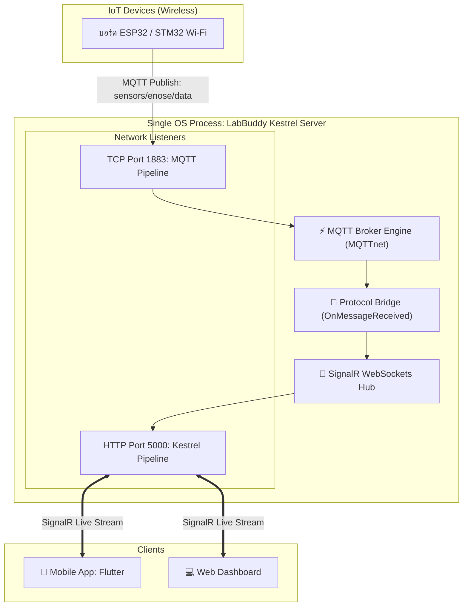

# ใบงานการทดลองที่ 6 (Lab 06): Kestrel Embedded MQTT Broker & IoT Gateway
> **โครงการ LabBuddy: เปลี่ยน Kestrel ให้เป็น Full MQTT Broker ในตัว (All-in-One Gateway)**  
> *(รองรับทั้ง HTTP, WebSockets, และ MQTT TCP พอร์ต 1883 ในโปรเซสเดียว โดยไม่ต้องติดตั้ง Mosquitto ภายนอก)*

---

## 🎯 วัตถุประสงค์การทดลอง (Objectives)
1. เข้าใจหลักการทำงานของโพรโทคอล **MQTT (Publish / Subscribe Pattern)** เทียบกับ **HTTP (Request / Response)**
2. สามารถติดตั้งและผสานรวมไลบรารี **`MQTTnet.AspNetCore`** เข้ากับ Kestrel Web Server
3. สามารถกำหนดค่าให้ Kestrel เปิดรับทั้ง **TCP พอร์ต 1883 (สำหรับอุปกรณ์ IoT / ESP32)** และ **HTTP พอร์ต 5000 (สำหรับ Web & Mobile App)** พร้อมกัน
4. สามารถเขียนกลไก **Protocol Bridging**: เมื่อมีข้อความ MQTT วิ่งเข้ามา ให้ส่งต่อ (Forward) เข้าสู่ **SignalR Hub** โดยอัตโนมัติ
5. สามารถทดสอบส่งข้อความจำลองจาก ESP32 ผ่านโปรแกรมทดสอบ MQTT เข้าสู่ Kestrel ได้

---

## 🧭 สถาปัตยกรรม All-in-One Gateway (Kestrel + MQTTnet)



---

## 🛠️ อุปกรณ์และซอฟต์แวร์ที่ต้องใช้
- เครื่องคอมพิวเตอร์ที่ติดตั้ง **.NET SDK 8.0** หรือ **9.0**
- แพ็กเกจ NuGet: `MQTTnet` และ `MQTTnet.AspNetCore`
- เครื่องมือทดสอบส่ง MQTT (เลือกอย่างใดอย่างหนึ่ง):
  - โปรแกรม GUI ยอดนิยม: [MQTTX](https://mqttx.app/) (ดาวน์โหลดฟรี)
  - หรือคำสั่ง Terminal: `mosquitto_pub` / Python script

---

## 🧪 ขั้นตอนที่ 1: การสร้างโปรเจกต์และติดตั้งไลบรารี MQTTnet
เปิด Terminal แล้วรันคำสั่ง:

```bash
# 1. สร้างโฟลเดอร์สำหรับ Lab 6
mkdir LabBuddy_Lab06 && cd LabBuddy_Lab06

# 2. สร้างโปรเจกต์ Web API
dotnet new web -o .

# 3. ติดตั้ง Package MQTTnet สำหรับ ASP.NET Core / Kestrel
dotnet add package MQTTnet
dotnet add package MQTTnet.AspNetCore
```

---

## 🧪 ขั้นตอนที่ 2: สร้าง Data Model และ SignalR Hub
เปิดไฟล์ `Program.cs` แล้วลบโค้ดเดิมออกทั้งหมด จากนั้นเริ่มเขียนส่วน Data Model และ Hub:

```csharp
using System;
using System.Text;
using System.Text.Json;
using System.Threading.Tasks;
using Microsoft.AspNetCore.Builder;
using Microsoft.AspNetCore.Hosting;
using Microsoft.AspNetCore.SignalR;
using Microsoft.Extensions.DependencyInjection;
using Microsoft.Extensions.Hosting;
using MQTTnet.AspNetCore;
using MQTTnet.Server;

// ============================================================================
// 1. DATA MODEL & SIGNALR HUB
// ============================================================================
public record MqttTelemetryPayload(
    string DeviceId,
    double Temperature,
    double Humidity,
    int GasAdc,
    string Timestamp
);

public class SensorHub : Hub
{
    // Hub สำหรับบรอดแคสต์ข้อมูลไปหามือถือ Flutter และ Web Browser
}
```

---

## 🧪 ขั้นตอนที่ 3: กำหนดค่า Kestrel ให้รับทั้ง HTTP (5000) และ MQTT (1883)
ต่อท้ายใน `Program.cs` ด้วยการคอนฟิก Kestrel Sockets:

```csharp
// ============================================================================
// 2. KESTREL DUAL-PORT CONFIGURATION (HTTP + MQTT)
// ============================================================================
var builder = WebApplication.CreateBuilder(args);

// ตั้งค่า Kestrel ให้แยกพอร์ตตามชนิดโพรโทคอล
builder.WebHost.ConfigureKestrel(options =>
{
    // พอร์ต 5000: ให้บริการ HTTP, REST API และ SignalR WebSockets
    options.ListenAnyIP(5000);

    // พอร์ต 1883: ให้บริการ TCP MQTT สำหรับไมโครคอนโทรลเลอร์ ESP32/STM32
    options.ListenAnyIP(1883, listenOptions =>
    {
        listenOptions.UseMqtt(); // สั่งให้ Kestrel ถอดรหัส Byte Stream ด้วย MQTT Parser
    });
});

// ลงทะเบียน Services ที่จำเป็น
builder.Services.AddSignalR();
builder.Services.AddHostedMqttServer(mqttBuilder =>
{
    mqttBuilder.WithDefaultEndpoint(); // เปิดใช้งาน Endpoint พื้นฐานของ MQTT
});
builder.Services.AddMqttConnectionHandler();

// เปิดใช้งาน CORS
builder.Services.AddCors(opts => opts.AddDefaultPolicy(p =>
    p.AllowAnyHeader().AllowAnyMethod().SetIsOriginAllowed(_ => true).AllowCredentials()));

var app = builder.Build();
app.UseCors();
```

---

## 🧪 ขั้นตอนที่ 4: เชื่อมโยง MQTT Message เข้าสู่ SignalR (Protocol Bridge)
ต่อท้ายใน `Program.cs` ด้วยโค้ดดักฟังข้อความจาก MQTT แล้วส่งต่อ:

```csharp
// ============================================================================
// 3. PROTOCOL BRIDGING & ENDPOINTS
// ============================================================================

// เชื่อมโยงเส้นทางของ SignalR Hub
app.MapHub<SensorHub>("/sensorHub");

// ผูก Kestrel เข้ากับ MQTTnet Connection Pipeline
app.UseMqttServer(server =>
{
    // เมื่อมีอุปกรณ์เชื่อมต่อเข้ามาที่ Broker
    server.ClientConnectedAsync += e =>
    {
        Console.WriteLine($">>> [MQTT CONNECTED] Client: {e.ClientId}");
        return Task.CompletedTask;
    };

    // เมื่อมีอุปกรณ์หลุดการเชื่อมต่อ
    server.ClientDisconnectedAsync += e =>
    {
        Console.WriteLine($"<<< [MQTT DISCONNECTED] Client: {e.ClientId}");
        return Task.CompletedTask;
    };

    // ========================================================================
    // หัวใจสำคัญ: ดักจับข้อความที่ ESP32 ยิงเข้ามา แล้วส่งต่อเข้า SignalR
    // ========================================================================
    server.InterceptingPublishAsync += async context =>
    {
        string topic = context.ApplicationMessage.Topic;
        string payload = Encoding.UTF8.GetString(context.ApplicationMessage.PayloadSegment);

        Console.WriteLine($"[MQTT IN] Topic: {topic} | Body: {payload}");

        // ตรวจสอบว่าใช่ Topic เซนเซอร์หรือไม่
        if (topic.StartsWith("sensors/"))
        {
            try
            {
                // ดึง Hub Context มาเพื่อบรอดแคสต์ไปหามือถือ Flutter
                var hubContext = app.Services.GetRequiredService<IHubContext<SensorHub>>();

                // ส่งข้อมูลออกทาง WebSocket ใน Event "OnReceiveTelemetry" ทันที!
                await hubContext.Clients.All.SendAsync("OnReceiveTelemetry", new
                {
                    topic = topic,
                    raw = payload,
                    receivedAt = DateTime.UtcNow
                });
            }
            catch (Exception ex)
            {
                Console.WriteLine($"[BRIDGE ERR] {ex.Message}");
            }
        }
    };
});

// หน้าตรวจสอบสถานะ
app.MapGet("/", () => Results.Ok(new {
    Server = "LabBuddy All-in-One Gateway",
    HttpPort = 5000,
    MqttPort = 1883,
    Status = "Running"
}));

Console.WriteLine("=================================================");
Console.WriteLine(" [LabBuddy] Kestrel Gateway is Ready!");
Console.WriteLine(" - HTTP & SignalR: http://0.0.0.0:5000");
Console.WriteLine(" - MQTT Broker:    mqtt://0.0.0.0:1883");
Console.WriteLine("=================================================");

app.Run();
```

---

## 🧪 ขั้นตอนที่ 5: การทดสอบรับ-ส่งข้อความ (Verification)

### 5.1 สั่งรัน Kestrel Gateway
เปิด Terminal แล้วรัน:
```bash
dotnet run
```
สังเกตข้อความบนหน้าจอ จะเห็นว่าเซิร์ฟเวอร์เปิดรับทั้ง **พอร์ต 5000** และ **พอร์ต 1883** พร้อมกัน

---

### 5.2 ทดสอบส่งข้อมูลจำลองผ่านโปรแกรม MQTT (เช่น MQTTX)
1. เปิดโปรแกรม **MQTTX** หรือเครื่องมือ MQTT ใดๆ
2. ตั้งค่า Connection:
   - **Host:** `localhost` หรือ IP ของเครื่องคอมพิวเตอร์
   - **Port:** `1883`
   - กดปุ่ม **Connect** $\rightarrow$ สังเกตว่าหน้าต่าง Kestrel จะพิมพ์:
     ```text
     >>> [MQTT CONNECTED] Client: mqttx_123456
     ```
3. ส่งข้อความ Publish:
   - **Topic:** `sensors/enose/data`
   - **Payload (JSON):**
     ```json
     {
       "deviceId": "ESP32-WiFi",
       "temperature": 27.5,
       "humidity": 61.2,
       "gasAdc": 1940
     }
     ```
4. สังเกตหน้าต่าง Terminal ของ Kestrel:
   ```text
   [MQTT IN] Topic: sensors/enose/data | Body: {"deviceId": "ESP32-WiFi", ...}
   ```
   *ข้อความนี้จะถูกสะพาน (Bridge) ส่งทะลุเข้า SignalR ไปโผล่บนหน้าจอมือถือ Flutter ทันที!*

---

## 📟 ภาคผนวก: ตัวอย่างโค้ดบนบอร์ด ESP32 (Arduino C++)

สำหรับเด็กนักศึกษาฝั่งฮาร์ดแวร์ สามารถใช้ไลบรารี `PubSubClient` เขียนบน ESP32 ได้ดังนี้:

```cpp
#include <WiFi.h>
#include <PubSubClient.h>

const char* ssid = "YOUR_WIFI_SSID";
const char* password = "YOUR_WIFI_PASSWORD";
const char* mqtt_server = "192.168.1.120"; // IP ของเครื่อง Kestrel

WiFiClient espClient;
PubSubClient client(espClient);

void setup() {
    Serial.begin(115200);
    WiFi.begin(ssid, password);
    while (WiFi.status() != WL_CONNECTED) { delay(500); }

    client.setServer(mqtt_server, 1883); // ชี้มาที่พอร์ต 1883 ของ Kestrel
}

void loop() {
    if (!client.connected()) {
        client.connect("ESP32_eNose_Client");
    }
    client.loop();

    // อ่านค่าเซนเซอร์แล้วส่ง JSON ทุกๆ 500 ms
    String payload = "{\"temp\": 26.8, \"gas\": 1820}";
    client.publish("sensors/enose/data", payload.c_str());

    delay(500);
}
```

---

## 🎯 ภารกิจท้าทายประจำแล็บ (Lab Challenge)
- ให้นักศึกษาเพิ่มฟังก์ชัน **Publish กลับไปยังฮาร์ดแวร์ (Two-way Communication)**: เมื่อมีคำสั่งส่งเข้ามาทาง HTTP `POST /api/valve/open` ให้ Kestrel ส่งคำสั่ง MQTT Publish หัวข้อ `actuators/valve` ไปยังบอร์ด ESP32 เพื่อเปิด-ปิดวาล์วลม
